# Binary Clock ESP32 - Class Diagram

This document contains the comprehensive class diagram for the WiFi Binary Clock project, showing all major classes, their relationships, and design patterns.

## Class Diagram

```mermaid
classDiagram
    %% ============================================================================
    %% INTERFACES
    %% ============================================================================
    class IBinaryClockBase {
        <<interface>>
        +set_Time(DateTime) void
        +get_Time() DateTime
        +set_Alarm(AlarmTime) void
        +get_Alarm() AlarmTime
        +set_Is12HourFormat(bool) void
        +get_Is12HourFormat() bool
        +get_TimeFormat() char*
        +get_AlarmFormat() char*
        +get_IsSerialSetup() bool
        +get_IsSerialTime() bool
        +get_S1TimeDec() IBCButtonBase&
        +get_S2SaveStop() IBCButtonBase&
        +get_S3AlarmInc() IBCButtonBase&
        +get_IdName() const char*
        +ReadTime() DateTime
        +DisplayLedPattern(LedPattern) void
        +DisplayBinaryTime(int, int, int, bool) void
        +RegisterTimeCallback(callback) bool
        +UnregisterTimeCallback(callback) bool
        +RegisterAlarmCallback(callback) bool
        +UnregisterAlarmCallback(callback) bool
        +PlayAlarm(AlarmTime&) void
    }

    class IBinaryClock {
        <<interface>>
        +DisplayLedPattern(LedPattern, unsigned long) void
        +PlayMelody(size_t) bool
        +RegisterMelody(vector~Note~&) size_t
        +GetMelodyById(size_t) vector~Note~&
    }

    class IBCButtonBase {
        <<interface>>
        +Initialize() void
        +IsPressed() bool
        +IsPressedRaw() bool
        +IsPressedNew() bool
    }

    %% ============================================================================
    %% MAIN CLASSES
    %% ============================================================================
    class BinaryClock {
        <<Singleton Pattern>>
        -static BinaryClock* _pInstance
        -BCMenu menu
        -BCButton buttons[3]
        -RTClibPlusDS3231 rtc
        -MorseCodeLED morseCodeLed
        -bool _is12HourFormat
        -AlarmTime _alarmTime
        -FastLED leds[17]
        #BinaryClock()
        #~BinaryClock()
        #BinaryClock(const BinaryClock&) = delete
        #operator=(const BinaryClock&) = delete
        +static get_Instance() BinaryClock&
        +Begin() bool
        +Loop() void
        +set_Time(DateTime) void
        +get_Time() DateTime
        +set_Alarm(AlarmTime) void
        +get_Alarm() AlarmTime
        +DisplayBinaryTime(int, int, int, bool) void
        +DisplayLedPattern(LedPattern) void
        +DisplayLedPattern(LedPattern, unsigned long) void
        +RegisterTimeCallback(callback) bool
        +PlayMelody(size_t) bool
        +RegisterMelody(vector~Note~&) size_t
        +GetMelodyById(size_t) vector~Note~&
    }

    class BCMenu {
        <<Dependency Injection>>
        -IBinaryClockBase& clockInterface
        -MenuState currentState
        -DateTime tempTime
        -AlarmTime tempAlarm
        +BCMenu(IBinaryClockBase&)
        +Update() void
        +IsActive() bool
        +get_State() MenuState
        +ProcessS1Press() void
        +ProcessS2Press() void
        +ProcessS3Press() void
    }

    class BCButton {
        -uint8_t pin
        -uint8_t onValue
        -uint8_t offValue
        -uint8_t lastStableValue
        -unsigned long lastBounceTime
        -bool wasPressed
        +BCButton(uint8_t, uint8_t, uint8_t)
        +Initialize() void
        +IsPressed() bool
        +IsPressedRaw() bool
        +IsPressedNew() bool
    }

    %% ============================================================================
    %% WIFI CLASSES
    %% ============================================================================
    class BinaryClockWAN {
        <<Singleton Pattern>>
        <<Dependency Injection>>
        -static BinaryClockWAN* _pInstance
        -BinaryClockSettings& settings
        -BinaryClockNTP& ntpClient
        -BinaryClockWPS& wpsClient
        -WiFiInfo _connectedAP
        -bool _isConnected
        #BinaryClockWAN()
        #~BinaryClockWAN()
        #BinaryClockWAN(const BinaryClockWAN&) = delete
        #operator=(const BinaryClockWAN&) = delete
        +static get_Instance() BinaryClockWAN&
        +Begin(IBinaryClock&, bool) bool
        +ConnectToAP(APCreds&) bool
        +StartWPS() WPSResult
        +get_IsConnected() bool
        +get_CurrentAP() WiFiInfo
    }

    class BinaryClockNTP {
        <<Singleton Pattern>>
        -static BinaryClockNTP* _pInstance
        -String timezone
        -bool _isSynced
        -DateTime _lastSync
        #BinaryClockNTP()
        #~BinaryClockNTP()
        #BinaryClockNTP(const BinaryClockNTP&) = delete
        #operator=(const BinaryClockNTP&) = delete
        +static get_Instance() BinaryClockNTP&
        +Begin() bool
        +SyncTime() bool
        +set_Timezone(String) void
        +get_Timezone() String
        +get_IsSynced() bool
        +RegisterSyncCallback(callback) bool
    }

    class BinaryClockWPS {
        <<Singleton Pattern>>
        -static BinaryClockWPS* _pInstance
        -unsigned long timeout
        #BinaryClockWPS()
        #~BinaryClockWPS()
        #BinaryClockWPS(const BinaryClockWPS&) = delete
        #operator=(const BinaryClockWPS&) = delete
        +static get_Instance() BinaryClockWPS&
        +Begin() bool
        +Connect(unsigned long) WPSResult
        +get_Timeout() unsigned long
        +set_Timeout(unsigned long) void
    }

    class BinaryClockSettings {
        <<Singleton Pattern>>
        -static BinaryClockSettings* _pInstance
        -Preferences prefs
        -vector~APCreds~ apList
        -String timezone
        #BinaryClockSettings()
        #~BinaryClockSettings()
        #BinaryClockSettings(const BinaryClockSettings&) = delete
        #operator=(const BinaryClockSettings&) = delete
        +static get_Instance() BinaryClockSettings&
        +Begin() bool
        +SaveAPCreds(APCreds&) bool
        +LoadAPCreds() vector~APCreds~
        +SaveTimezone(String) bool
        +LoadTimezone() String
        +ClearAll() bool
    }

    %% ============================================================================
    %% HARDWARE LIBRARY CLASSES
    %% ============================================================================
    class RTClibPlusDS3231 {
        -TwoWire& wire
        +RTClibPlusDS3231(TwoWire&)
        +begin() bool
        +now() DateTime
        +adjust(DateTime&) void
        +isrunning() bool
        +getTemperature() float
    }

    class MorseCodeLED {
        -int ledPin
        +MorseCodeLED(int)
        +Begin() void
        +Flash_CQD_NO_RTC() void
        +FlashCharacter(char) void
        +FlashString(String&) void
        +FlashProsign(Prosign) void
        +FlashProsignWord(String) void
    }

    %% ============================================================================
    %% DATA STRUCTURES
    %% ============================================================================
    class AlarmTime {
        <<struct>>
        +uint8_t hour
        +uint8_t minute
        +uint8_t status
    }

    class WiFiInfo {
        <<struct>>
        +String ssid
        +int32_t rssi
        +String ipAddress
        +String macAddress
    }

    class APCreds {
        <<struct>>
        +String ssid
        +String password
    }

    class APCredsPlus {
        <<struct>>
        +String ssid
        +String password
        +uint8_t channel
        +String bssid
    }

    class WPSResult {
        <<struct>>
        +bool success
        +String ssid
        +String password
        +String errorMsg
    }

    class Note {
        <<struct>>
        +uint16_t frequency
        +uint16_t duration
    }

    class DateTime {
        <<RTClib class>>
        +DateTime()
        +DateTime(uint16_t, uint8_t, uint8_t, uint8_t, uint8_t, uint8_t)
        +year() uint16_t
        +month() uint8_t
        +day() uint8_t
        +hour() uint8_t
        +minute() uint8_t
        +second() uint8_t
        +toString(char*, size_t, const char*) void
    }

    class LedPattern {
        <<enumeration>>
        onColors
        offColors
        onText
        offTxt
        xAbort
        okText
        rainbow
        wText
        aText
        pText
        nText
        endTAG
    }

    %% ============================================================================
    %% RELATIONSHIPS
    %% ============================================================================
    
    %% Interface inheritance
    IBinaryClock --|> IBinaryClockBase : extends
    
    %% Interface implementations
    BinaryClock ..|> IBinaryClock : implements
    BCButton ..|> IBCButtonBase : implements
    
    %% Composition relationships
    BinaryClock *-- BCMenu : contains
    BinaryClock *-- BCButton : contains[3]
    BinaryClock *-- RTClibPlusDS3231 : uses
    BinaryClock *-- MorseCodeLED : uses
    BinaryClockWAN *-- BinaryClockSettings : uses
    BinaryClockWAN *-- BinaryClockNTP : uses
    BinaryClockWAN *-- BinaryClockWPS : uses
    
    %% Dependency injection relationships
    BCMenu ..> IBinaryClockBase : depends on
    BinaryClockWAN ..> IBinaryClock : depends on
    
    %% Data structure usage
    BinaryClock ..> AlarmTime : uses
    BinaryClock ..> DateTime : uses
    BinaryClock ..> LedPattern : uses
    BinaryClock ..> Note : uses
    BinaryClockWAN ..> WiFiInfo : uses
    BinaryClockWAN ..> APCreds : uses
    BinaryClockWAN ..> APCredsPlus : uses
    BinaryClockWAN ..> WPSResult : uses
    BinaryClockSettings ..> APCreds : stores
    BinaryClockSettings ..> APCredsPlus : stores
    BinaryClockWPS ..> WPSResult : returns

    %% Notes
    note for BinaryClock "Singleton: Protected ctor, deleted copy/move, static get_Instance()"
    note for BinaryClockWAN "Singleton + DI: Begin() accepts IBinaryClock& reference"
    note for BinaryClockNTP "Singleton: Manages SNTP sync and timezone configuration"
    note for BinaryClockWPS "Singleton: WPS Push Button connection manager"
    note for BinaryClockSettings "Singleton: NVS storage for credentials and settings"
    note for BCMenu "DI: Constructor accepts IBinaryClockBase& reference"

    %% ============================================================================
    %% CLICKABLE LINKS TO SOURCE FILES
    %% ============================================================================
    click IBinaryClockBase href "https://github.com/Chris-70/WiFiBinaryClock/blob/main/lib/BCGlobalDefines/src/IBinaryClockBase.h"
    click IBinaryClock href "https://github.com/Chris-70/WiFiBinaryClock/blob/main/lib/BCGlobalDefines/src/IBinaryClock.h"
    click IBCButtonBase href "https://github.com/Chris-70/WiFiBinaryClock/blob/main/lib/BCGlobalDefines/src/IBCButtonBase.h"
    click BinaryClock href "https://github.com/Chris-70/WiFiBinaryClock/blob/main/lib/BinaryClock/src/BinaryClock.h"
    click BCMenu href "https://github.com/Chris-70/WiFiBinaryClock/blob/main/lib/BinaryClock/src/BCMenu.h"
    click BCButton href "https://github.com/Chris-70/WiFiBinaryClock/blob/main/lib/BinaryClock/src/BCButton.h"
    click BinaryClockWAN href "https://github.com/Chris-70/WiFiBinaryClock/blob/main/lib/BinaryClockWiFi/src/BinaryClockWAN.h"
    click BinaryClockNTP href "https://github.com/Chris-70/WiFiBinaryClock/blob/main/lib/BinaryClockWiFi/src/BinaryClockNTP.h"
    click BinaryClockWPS href "https://github.com/Chris-70/WiFiBinaryClock/blob/main/lib/BinaryClockWiFi/src/BinaryClockWPS.h"
    click BinaryClockSettings href "https://github.com/Chris-70/WiFiBinaryClock/blob/main/lib/BinaryClockWiFi/src/BinaryClockSettings.h"
    click RTClibPlusDS3231 href "https://github.com/Chris-70/WiFiBinaryClock/blob/main/lib/RTClibPlus/src/RTClib.h"
    click MorseCodeLED href "https://github.com/Chris-70/WiFiBinaryClock/blob/main/lib/MorseCodeLED/src/MorseCodeLED.h"
    click AlarmTime href "https://github.com/Chris-70/WiFiBinaryClock/blob/main/lib/BCGlobalDefines/src/BinaryClock.Structs.h"
    click WiFiInfo href "https://github.com/Chris-70/WiFiBinaryClock/blob/main/lib/BCGlobalDefines/src/BinaryClock.Structs.h"
    click APCreds href "https://github.com/Chris-70/WiFiBinaryClock/blob/main/lib/BCGlobalDefines/src/BinaryClock.Structs.h"
    click APCredsPlus href "https://github.com/Chris-70/WiFiBinaryClock/blob/main/lib/BCGlobalDefines/src/BinaryClock.Structs.h"
    click WPSResult href "https://github.com/Chris-70/WiFiBinaryClock/blob/main/lib/BCGlobalDefines/src/BinaryClock.Structs.h"
    click Note href "https://github.com/Chris-70/WiFiBinaryClock/blob/main/lib/BCGlobalDefines/src/BinaryClock.Structs.h"
    click DateTime href "https://github.com/Chris-70/WiFiBinaryClock/blob/main/lib/RTClibPlus/src/DateTime.h"
    click LedPattern href "https://github.com/Chris-70/WiFiBinaryClock/blob/main/lib/BCGlobalDefines/src/BinaryClock.Structs.h"
```

## Design Patterns Used

### Singleton Pattern
The following classes implement the Singleton pattern to ensure only one instance exists:

- **BinaryClock**: Main hardware controller singleton
  - Manages Binary Clock Shield hardware (LEDs, buttons, RTC)
  - Contains menu and button instances
  - Protected constructor, deleted copy/move, static `get_Instance()`
  
- **BinaryClockWAN**: WiFi connection manager singleton
  - Manages WiFi connection state and multi-AP failover
  - Uses dependency injection (`Begin(IBinaryClock&)`)
  - Protected constructor, deleted copy/move, static `get_Instance()`
  
- **BinaryClockNTP**: NTP time synchronization singleton
  - Handles SNTP protocol integration
  - Manages timezone configuration (Proleptic format)
  - Protected constructor, deleted copy/move, static `get_Instance()`
  
- **BinaryClockWPS**: WPS connection setup singleton
  - Implements WPS Push Button mode
  - Extracts credentials from successful WPS connection
  - Protected constructor, deleted copy/move, static `get_Instance()`
  
- **BinaryClockSettings**: Settings persistence singleton
  - Stores WiFi credentials and timezone in ESP32 NVS
  - Provides serialization/deserialization
  - Protected constructor, deleted copy/move, static `get_Instance()`

**Implementation details:**
- Protected constructor and destructor
- Deleted copy constructor: `ClassName(const ClassName&) = delete`
- Deleted assignment operator: `operator=(const ClassName&) = delete`
- Static `get_Instance()` method returns reference to single instance
- Private static pointer to instance: `static ClassName* _pInstance`

### Dependency Injection
The following classes use dependency injection to reduce coupling:

- **BCMenu**: 
  - Constructor: `explicit BCMenu(IBinaryClockBase& clockInterface)`
  - Stores reference to `IBinaryClockBase` interface
  - Allows menu to work with any implementation without tight coupling to `BinaryClock`
  - Enables testing with mock implementations

- **BinaryClockWAN**: 
  - Method: `Begin(IBinaryClock& clock, bool autoConnect)`
  - Accepts `IBinaryClock` interface reference during initialization
  - Uses interface for LED pattern display and melody playback
  - Enables WiFi operations without direct coupling to concrete `BinaryClock` class

### Interface Pattern
Pure abstract interfaces decouple implementation from usage:

- **IBinaryClockBase**: 
  - Defines minimum contract for Binary Clock functionality
  - Provides core time/alarm/display operations
  - Used by `BCMenu` for settings manipulation
  - All methods pure virtual (`= 0`)

- **IBinaryClock**: 
  - Extends `IBinaryClockBase` with additional functionality
  - Adds LED pattern duration, melody registration/playback
  - Used by `BinaryClockWAN` for visual/audio feedback
  - All methods pure virtual (`= 0`)

- **IBCButtonBase**: 
  - Defines contract for button implementations
  - Provides initialization, state reading, debouncing
  - All methods pure virtual (`= 0`)

## Key Relationships

### Hardware Management
`BinaryClock` singleton directly manages all hardware:
- **3 x `BCButton`** instances (S1: Time/Dec, S2: Save/Stop, S3: Alarm/Inc)
- **1 x `RTClibPlusDS3231`** RTC instance (DS3231 I²C real-time clock)
- **1 x `MorseCodeLED`** instance (error signaling via Morse code)
- **17 x FastLED** WS2812B RGB LEDs (binary time display)
- **1 x `BCMenu`** instance (3-button settings menu state machine)

### WiFi Management
`BinaryClockWAN` singleton orchestrates all WiFi operations:
- **`BinaryClockSettings`**: Loads/saves AP credentials and timezone
- **`BinaryClockNTP`**: Synchronizes time via SNTP after connection
- **`BinaryClockWPS`**: Handles WPS Push Button setup
- **`IBinaryClock&`**: Receives reference via `Begin()` for LED/melody feedback

### Abstraction Layers
- **`BCMenu`** → `IBinaryClockBase`: Menu uses interface to manipulate time/alarm/display
- **`BinaryClockWAN`** → `IBinaryClock`: WiFi uses interface for status feedback (LED patterns, melodies)
- **`BCButton`** implements `IBCButtonBase`: Enables polymorphic button handling
- **`BinaryClock`** implements `IBinaryClock` → `IBinaryClockBase`: Provides concrete implementation

## Class Responsibilities

### BinaryClock
**Main hardware controller singleton** responsible for:
- Hardware initialization (I²C bus, LED strip, GPIO buttons, buzzer)
- Time display on 17-LED array (binary format: hours, minutes, seconds)
- Alarm functionality (time comparison, alarm triggering)
- Button input handling (debouncing, state management via `BCButton`)
- Menu system integration (passes `IBinaryClockBase&` to `BCMenu`)
- Melody/tone playback (buzzer control, melody registry)
- LED pattern display (animations, WiFi status indicators)
- RTC communication (read/write time, alarm management)

### BCMenu
**Settings menu state machine** that:
- Provides 3-button UI for settings (S1: Dec/Time, S2: Save/Stop, S3: Inc/Alarm)
- Manages time/alarm setting workflow (digit selection, value adjustment)
- Uses `IBinaryClockBase` interface for clock operations (decoupled from concrete implementation)
- Maintains temporary values during editing (rollback on cancel)
- State transitions (Idle → TimeSet → AlarmSet → Display)
- Visual feedback via LED patterns during menu navigation

### BCButton
**Button handler with debouncing** providing:
- Hardware pin management (configurable pin, supports CA/CC wiring)
- Debounce logic (configurable delay, stable state tracking)
- State change detection (`IsPressedNew()` for edge detection)
- Press/release event detection (tracks state transitions)
- Raw state reading (`IsPressedRaw()` bypasses debounce)
- Support for both Common Anode (CA) and Common Cathode (CC) wiring

### BinaryClockWAN
**WiFi connection manager singleton** that:
- Handles multi-AP connection attempts (tries all stored credentials in order)
- Manages connection state (connected, disconnected, connecting)
- Integrates WPS functionality (`StartWPS()` delegates to `BinaryClockWPS`)
- Coordinates with settings (`BinaryClockSettings` for credential storage)
- Coordinates with NTP (`BinaryClockNTP` for time sync after connection)
- Uses dependency injection (`Begin(IBinaryClock&)` for LED/melody feedback)
- Provides connection status (`get_IsConnected()`, `get_CurrentAP()`)

### BinaryClockNTP
**NTP time synchronization singleton** that:
- Synchronizes time via ESP32 SNTP protocol (`esp_sntp.h`)
- Manages timezone configuration (Proleptic format: e.g., `CST6CDT,M3.2.0,M11.1.0`)
- Provides sync callbacks (notifies when time synchronized)
- Integrates with ESP32 SNTP library (native ESP-IDF support)
- Tracks sync status (`get_IsSynced()`, last sync time)
- Supports automatic periodic resync

### BinaryClockWPS
**WPS connection handler singleton** that:
- Implements WPS Push Button mode (ESP32 WPS APIs: `esp_wifi_wps_*`)
- Extracts credentials from successful WPS connection
- Manages timeout handling (configurable timeout, default 120s)
- Returns structured WPS results (`WPSResult`: success, SSID, password, error)
- Cleans up WPS resources after connection attempt

### BinaryClockSettings
**Settings persistence singleton** that:
- Stores/retrieves WiFi credentials for multiple APs (vector of `APCreds`/`APCredsPlus`)
- Stores/retrieves timezone configuration (Proleptic format string)
- Uses ESP32 NVS (Non-Volatile Storage via `Preferences` library)
- Provides serialization/deserialization (converts structs to/from NVS format)
- Supports credential management (add, remove, clear all)
- Persistent across power cycles

### RTClibPlusDS3231
**DS3231 RTC hardware interface** (forked from Adafruit RTClib):
- I²C communication with DS3231 chip
- Time reading (`now()` returns `DateTime`)
- Time setting (`adjust(DateTime&)` writes to RTC)
- Hardware status (`isrunning()` checks oscillator)
- Temperature reading (`getTemperature()` from DS3231 sensor)

### MorseCodeLED
**Morse code error signaling**:
- Flashes LED in Morse code patterns
- Predefined message: `"CQD NO RTC"` (RTC initialization failure)
- Arbitrary string support (full Morse code alphabet and numbers)
- Prosign support (AR, SK, SOS, etc.)
- Timing: dot=200ms, dash=600ms, letter space=600ms, word space=1400ms

---

## Data Structures

### AlarmTime
- **hour**: 0-23 (24-hour format)
- **minute**: 0-59
- **status**: 0=inactive, 1=active

### WiFiInfo
- **ssid**: Network name
- **rssi**: Signal strength (dBm)
- **ipAddress**: Assigned IP address
- **macAddress**: Device MAC address

### APCreds
- **ssid**: Network name
- **password**: Network password

### APCredsPlus
- **ssid**: Network name
- **password**: Network password
- **channel**: WiFi channel (1-13)
- **bssid**: Base station MAC address

### WPSResult
- **success**: Connection success flag
- **ssid**: Connected network name
- **password**: Extracted password
- **errorMsg**: Error description (if failed)

### Note
- **frequency**: Tone frequency (Hz)
- **duration**: Note duration (ms)

### DateTime (RTClib)
- Year, month, day, hour, minute, second
- String formatting (`toString()`)
- Arithmetic operations (add/subtract `TimeSpan`)

### LedPattern (enumeration)
- `onColors`: LED colors when ON (hours, minutes, seconds)
- `offColors`: LED colors when OFF (usually black, no power)
- `onText`: Big green **O** for the On pattern
- `offTxt`: Big red sideways **F** for the oFF pattern
- `xAbort`: Big pink **X** [❌] for abort/cancel pattern
- `okText`: Big lime **✓** [✅] for okay/good pattern
- `rainbow`: Rainbow colors on diagonal pattern
- `wText`: Big royal blue **W** [📶] for WPS/WiFi pattern (WIFI only)
- `aText`: Big indigo **A** [ᐋ] for AP Access web page pattern (WIFI only)
- `pText`: Big orange **P** [ᐳ] for Phone app pattern (WIFI only)
- `nText`: Big yellow **N** for NTP sync pattern (WIFI only)
- `endTAG`: End marker, equal to number of patterns (7 or 11)

---

**Note**: This diagram focuses on architectural relationships and design patterns. Many private implementation details, helper methods, and internal state variables are omitted for clarity. Refer to individual class headers for complete method signatures, documentation, and implementation details.
