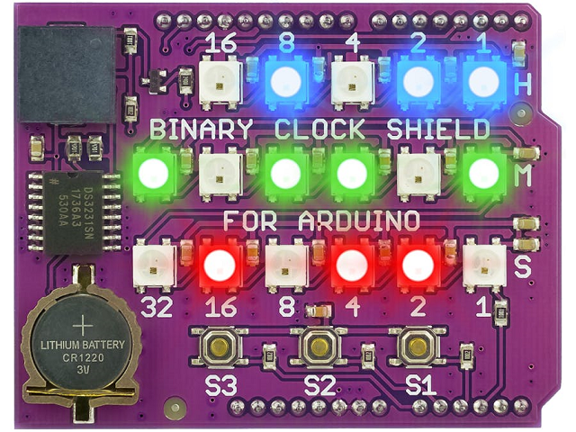
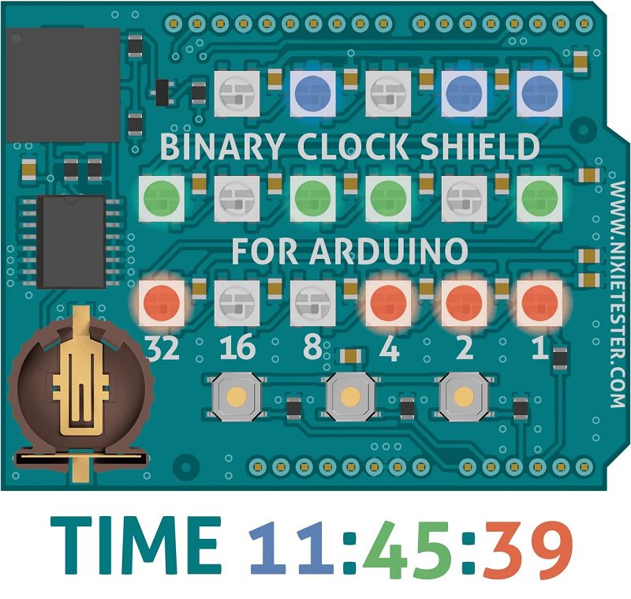
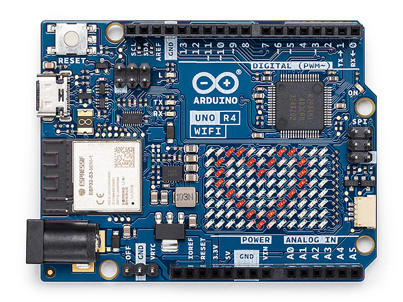
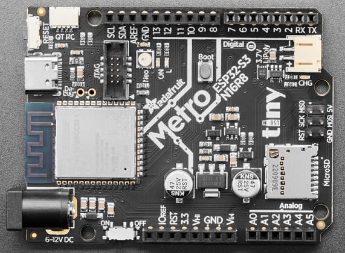
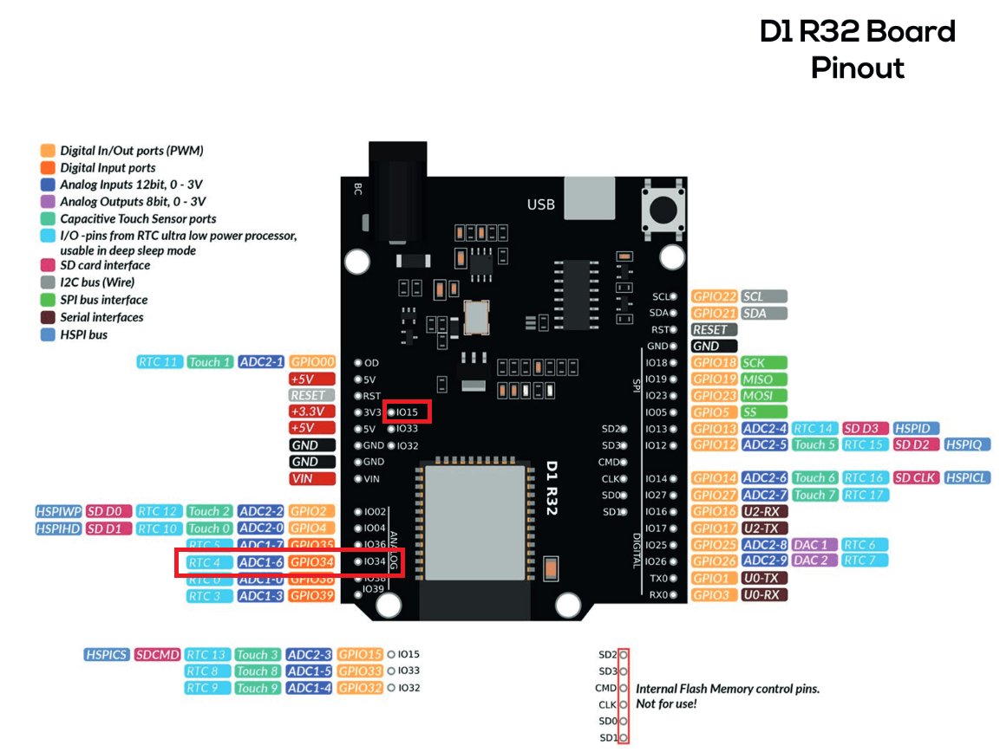
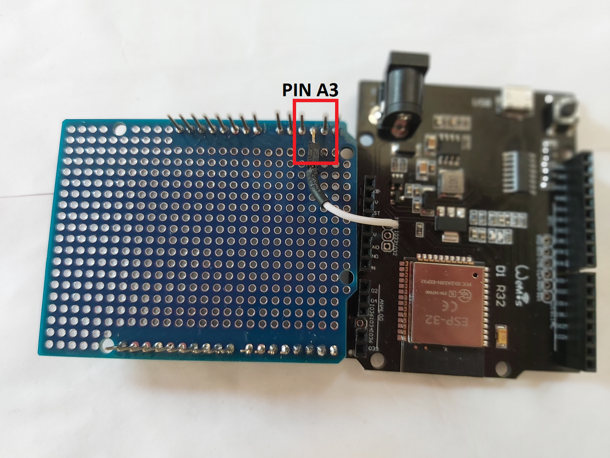

# WiFiBinaryClock

## Binary Clock for Arduino UNO on an ESP32

 [](https://nixietester.com/product/binary-clock-shield-for-arduino/)

[The Binary Clock Shield for Arduino UNO](https://nixietester.com/product/binary-clock-shield-for-arduino/) is the best LED Binary Clock I've seen and I own way too many binary clocks.

This project was created to unlock the full potential of this great Binary Clock. Being an Arduino Shield means that we can substitute the UNO R3 for something much more powerful. I wanted to get my Wemos D1 R32 ESP32 UNO board to work with this shield [^1], then it could connect to any NTP server over WiFi and keep the time synced whenever we switch to/from daylight savings time. In addition we could change the colors of the LEDs and upload new alarm melodies, etc. and do it from a phone or computer. The result of this project is the `WiFiBinaryClock` code which supports the following boards:

[^1]: The Wemos D1 R32 ESP32 UNO board requires a minor hardware modification to work with the Binary Clock Shield, see the details in the [Hardware Modifications](#details-and-hardware-modifications) section of this document.

## **Usage:**

The user needs to define the target board being used for this code to compile. The choices are:

1.   **ESP32\_D1\_R32\_UNO** - The generic Wemos D1 R32 UNO clone board with the original ESP32-32-WROOM module.
2.   **METRO\_ESP32\_S3** - The great [Adafruit Metro ESP32-S3](https://www.adafruit.com/product/5500) board.
3.   **ESP32\_S3\_UNO** - The generic UNO clone board with the new ESP32-S3 module.
4.  **UNO\_R4\_WIFI** - The new [Arduino UNO R4 WiFi](https://store.arduino.cc/collections/uno/products/uno-r4-wifi) board.
5.  **UNO\_R4\_MINIMA** - The no WiFi [R4 Minima](https://store.arduino.cc/collections/uno/products/uno-r4-minima) board.
6.   **UNO\_R3** -  The original [Arduino UNO R3](https://store.arduino.cc/collections/uno/products/arduino-uno-rev3) board.
7.  **CUSTOM\_UNO** - An UNO board you define in ["`board_select.h`"](./lib/BinaryClock/src/board_select.h) and enable.

Add one of these defines to the compiler options (e.g. `-D METRO_ESP32_S3`) or include a preprocessor definition (e.g. `#define METRO_ESP32_S3`) at the start of the [BinaryClock.defines.h file](./lib/BinaryClock/src/BinaryClock.Defines.h). The first 4 boards listed have builtin WiFi so they will be able to adjust their time over WiFi, while the UNO R3 and R4 Minima do not have WiFi onboard so they are limited to time/alarm setting from the 3 buttons on the shield. If you have a custom UNO board, modify the [board\_select.h file](./lib/BinaryClock/src/board_select.h) with the correct definitions for your board.

The code was developed using the excellent [PlatformIO IDE](https://platformio.org/) extension for the [VSCode](https://code.visualstudio.com/) editor. The file, `platformio.ini`, includes the setup for each of the supported boards so all you need to do is specify which one you're using.

## **Supported Boards**

The following boards are supported by this code:

*   [The Arduino UNO R4 WiFi is supported](https://store.arduino.cc/collections/uno/products/uno-r4-wifi)  
    [](https://store.arduino.cc/collections/uno/products/uno-r4-wifi)
*   [The Adafruit Metro ESP32-S3 is supported](https://www.adafruit.com/product/5500).  
    [](https://www.adafruit.com/product/5500).
*   There are other ESP32-S3 UNO style boards, such as one based on the ESP32-S3-DevKitC-1 pinout,  
    [](./assets/ESP32-S3_UNO_Board.png)  
    these work well with the Binary Clock Shield. They are available from you favorite Chinese website for under $10. This code fully supports this board, no hardware modifications are needed as the pinouts are different and the ESP32-S3 doesn't appear to have INPUT only pins.
*   The Wemos D1 R32 ESP32 UNO  
      
    board is supported, however it requires a hardware modification to work with the shield. See the details below.

## Details and Hardware Modifications

The Binary Clock Shield is designed to work with the Arduino UNO R3 board, however it can be used with other boards that have the same pinout as the UNO. When I got my first ESP32 based UNO board I tried it with the Binary Clock Shield only to find that it didn't work. I got errors for everything, I figured out that the board used different pin number compared to the UNO R3, to I make the changes to the pin numbers and I still had errors compiling. The Wemos D1 R32 ESP32 based UNO type board seemed like the ideal candidate however I discovered it had a hardware limitation. The shield uses UNO pin `A3` for the Neopixel LED data out pin, this pin corresponds to the ESP32 `GPIO 34` pin which is an input only pin.

In order to get this to work with the shield, the corresponding pin on the shield needs to be connected to an output pin such as `GPIO 15`. To do this you need to physically remove the A3/GPIO34 socket from the ESP32 UNO board (cut the plastic and desolder the pin) then connect the corresponding shield pin to `GPIO 15`.



The alternative is to get an Arduino UNO Development Shield and modify the shield by bending the 'A3' pin and use a Dupont connector between the bent `A3` pin and `GPIO 15` to use an output capable GPIO pin. This is the easiest but it does add some height to the assembly.



The advantages of a development Shield are that you can add additional components, such as add a LDR circuit to monitor and adjust the brightness based on ambient light.

## The Software

### Background

The software was based on the [example/11-BinaryClockRTCInterruptAlarmButtons](https://github.com/marcinsaj/Binary-Clock-Shield-for-Arduino/tree/master/example/11-BinaryClockRTCInterruptAlarmButtons) on the GitHub [marcinsaj/Binary-Clock-Shield-for-Arduino](https://github.com/marcinsaj/Binary-Clock-Shield-for-Arduino). I kept the core methods and created the `BinaryClock` class to handle all the base operations of the Binary Clock Shield. The class would perform everything related to the Binary Clock Shield, such as setting the time, alarms, and handling the button presses. The class also handles the display of the time and alarms on the NeoPixel LED strip.  
  
The `BinaryClock` class extended the basic capabilities of the original code by:

1.  Adding support for many different UNO boards and allowing for users to define their own board:
    *   The code supports the original [Arduino UNO R3](https://store.arduino.cc/collections/uno/products/arduino-uno-rev3) board.
    *   The new [Arduino UNO R4 WiFi](https://store.arduino.cc/collections/uno/products/arduino-uno-rev4-wifi) & [Minima](https://store.arduino.cc/collections/uno/products/arduino-minima) boards.
    *   The [Adafruit Metro ESP32-S3](https://www.adafruit.com/product/5400) board.
    *   The ESP32-S3 based UNO boards.
    *   The Wemos D1 R32 ESP32 based UNO board, which requires a hardware modification to work with the Binary Clock Shield.
    *   The user can define their own board by modifying the [`board_select.h`](./lib/BinaryClock/src/board_select.h) file.
2.  Adding full support for displaying the hours in 12 hour format with AM/PM indicator in addition to the 24 hour format.
    *   The user can change the hour format in the Time setting menu.
    *   The alarm hours format follows the selected time hours format.
    *   The DS3231 RTC chip is set to the selected time format, so the selected format will return after the power is lost.
3.  Changes to the User eXperience (UX) by allowing the user to exit the time and alarm settings menu without making any changes.
    *   For time setting, the user first selects: 12 hour; 24 hour; or eXit.
        *   The eXit is shown with a large '**X**' \[❌\] on the LEDs.
        *   The 12 hour mode is shown with the PM indicator and a binary value of 12 on the hours row.
        *   The 24 hour mode is shown as the binary value of 24 on the hours row.
    *   For the alarm settings, the user first selects: On; oFF; or eXit.
        *   The eXit is shown with a large '**X**' \[❌\] on the LEDs.
        *   The On is shown as a large O on the LEDs.
        *   The oFF is shown as a large sideways F on the LEDs.
    *   Setting the minutes and seconds remain umchanged.
    *   When the user has finished with the settings menu the following occur:
        *   The screen is filled with the colors of the rainbow signaling the end of the setting menu.
        *   The result of the settings menu is displayed to the user:
            *   Success: a large checkmark \[✅\] is shown on the LEDs indicating the changes were saved.
            *   Cancel/Abort: a large '**X**' \[❌\] is shown on the LEDs indicating nothing was changed.
4.  Adding support for changing the colors of the NeoPixel LED indicators for the: hours; minutes; and seconds as well as AM and PM indicators.
    *   The user can change the ON color for each individual LED indicator as well as change the OFF color for all the LEDs.
        *   Default ON colors are:
            *   hours = Blue 🟦 ;
            *   minutes = Green 🟢 ;
            *   seconds = Red 🟠 ;
            *   AM = Black ◉ ;
            *   PM = Purple 🟣 .
        *   Default OFF color is: Black F789; .
            *   Using any color other than black means the LED will always be lit.
5.  Adding support for playing different, user supplied, melodies for the alarms.
    *   The user can upload their own melodies and use them for the alarms.
        *   The melody is stores as an array of frequencies.
        *   An array of tones, the same size as the melody array, is used to define the duration of each note in the melody.
            *   The tones are stored as the number of milliseconds to play each note.
        *   The melody is played using the `tone()` function on the UNO R3 and R4 boards.
        *   The melody is played using the `ledcWriteTone()` function on the ESP32 based boards.
6.  Added callback handling for the Time and Alarm. This allows the `BinarClock` class to be implemented as a library and be part of another class or project.
    *   The `Time` callback is called every second when the time is updated.
    *   The `Alarm` callback is called when the alarm goes off.
    *   The callbacks remain active even when the user is in the settings menu and the time isn't being displayed on the shield.
    *   The callback handler is implemented differently depending on the board being used:
        *   For the UNO R3 and R4 Minima boards, the callback is handled in the `loop()` method by checking a flag that is set in the RTC alarm interrupt service routine (ISR). On these boards the callback routine are blocking calls.
        *   For the ESP32 based boards running FreeRTOS, the callback is handled in a separate task. The task waits for a notification from the `BinaryClock::timeDispatch()` method and calls the `Time` or `Alarm` callback routines from its own thread.
7.  Added error handling for critical errors where the program can't continue such as not being able to communicate with the RTC chip.
    *   The error handling consists of displaying an error code on a LED on the board such as the builtin LED.
    *   Watchdog time is triggered after ~2.1 seconds has elapsed without an update.
    *   Instead of using some custom code of blinking LEDs I decided to have some fun and use Morse code to display the error code. My first instinct was to flash SOS, but I learned that this is not cool. SOS is reserved for an actual distress signal and must never be used for anything else. So I decided to write a Morse Code class to blink the message on the LEDs. I also took the opertunity to see what AI (in this case CoPilot) could come up with and it did a mixed job. The encoding of the Morse code was a good idea from CoPilot but then it couldn't get the codes correct for all letters, numbers and punctuation. It also wrote lots of duplicate code in the methods and the code wasn't at all robust. It was an educational experience, you need to have experience or CoPilot will lead you down the garden path.
        *   The error code is displayed as a series of Morse code blinks on the LED. SOS is **NOT** used as this is an actual distress signal. **CQD** should used instead, which stands for "Come Quick Distress". This is the original distress signal taht was replaced by SOS. It is probably a good choice when it isn't an actual life critical distress that needs to be communicated.
            *   The default message, when the program enters the `purgatoryTask()` is **CQD NO RTC** in Morse code. This stands for "Come Quick Distress NO Real Time Clock".
            *   The UNO R3 can only play this message as it doesn't have enough memory to store the code needed for additional messages. All other boards can blink any message in Morse code on the assigned LED.
        *   The Morse code is implemented from the `MorseCodeLED` class in the [MorseCodeLED.h](./lib/MorseCodeLED/MorseCodeLED.h) and [MorseCodeLED.cpp](./lib/MorseCodeLED/MorseCodeLED.cpp) files.

## **Note:**

This code uses a forked version of [Adafruit's RTClib library](https://github.com/adafruit/RTClib), see the [README.md](./lib/RTClib/README.md) file for more information. The forked library is called `RTCLibPlus` and is available on GitHub at [https://github.com/Chris-70/RTClibPlus](https://github.com/Chris-70/RTClibPlus). It has been modified to:

*   Make the inherited base class `RTC_I2C` public for the `RTC_DS3231` class (and all other child classes), e.g. `class RTC_DS3231 : public RTC_I2C`.
*   It removes the DS3231 interrupt enable check (register 0x0E, bit: 4) when setting alarms. This check has no reason to be there as setting the alarm time on the DS3231 chip is independent of the interrupt setting. The Binary Clock makes use of the SQW pin for the 1 Hz signal, this is the same physical pin as the alarm interrupt pin. The Binary Clock still needs to set the alarm time values as the code checks for the alarm without needing the interrupt pin. This allows the rest of the code to set the alarm time registers. In the methods: `bool RTC_DS3231::setAlarm1(const DateTime &dt, Ds3231Alarm1Mode alarm_mode)` and `bool RTC_DS3231::setAlarm2(const DateTime &dt, Ds3231Alarm1Mode alarm_mode)`, the removed code was:
*   An additional method was added to the `DateTime` class, `char* toString(char* buffer, size_t size, const char *format) const;`. This method takes the `format` string and copies it to the `buffer` before calling `char *toString(char *buffer) const;` allowing the method to be used inline without the need to format the buffer first. Example: `Serial << time.toString(buffer, 31, "hh:mm AP on DDD. MMM. DD, YYYY");` instead of needing two lines: `strncpy(buffer, "hh:mm AP on DDD. MMM. DD, YYYY", 32); Serial << time.toString(buffer);`.

A fork of the `RTCLib`, `RTCLibPlus`, is available ([https://github.com/Chris-70/RTClibPlus](https://github.com/Chris-70/RTClibPlus)) while the pull request, # 313, for RTClib is pending.

```cpp
//   if (!(ctrl & 0x04)) {`
//     return false;`
//   }`
```