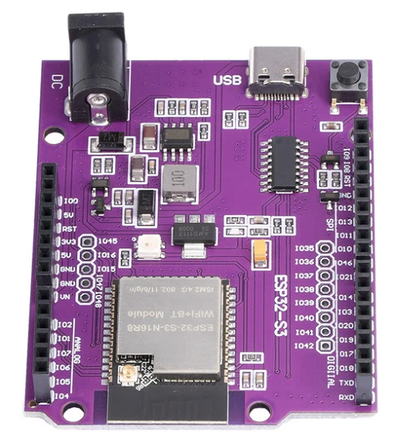

# WiFiBinaryClock

## Binary Clock for Arduino ESP32 UNO

[The Binary Clock Shield for Arduino UNO](https://nixietester.com/product/binary-clock-shield-for-arduino/) is the best Binary Clock I've seen and I own way too many binary clocks.

This project was created to unlock the full potential of this great Binary Clock. Being an Arduino Shield means that we can substitute the UNO R3 for something much more powerful. I wanted to get my Wemos D1 R32 ESP32 UNO board to work with this shield, then it could connect to a NTP server over WiFi and keep the time synced whenever we switch to/from daylight savings time. In addition we could change the colors of the LEDs and upload new alarm melodies from a phone or computer.

The Wemos D1 R32 ESP32 based UNO type board seemed like the ideal candidate however it had a hardware limitation. The shield uses UNO pin `A3` for the LED data out pin, this pin corresponds to the ESP32 `GPIO 34` pin which is an input only pin. In order to get this to work with the shield, the corresponding pin on the shield needs to be connected to an output pin such as `GPIO 15`. To do this you need to physically remove the A3/GPIO34 socket from the ESP32 UNO board (cut the plastic and desolder the pin) then connect the corresponding shield pin to `GPIO 15`.

The alternative is to get an Arduino UNO Development Shield and modify the shield by bending the 'A3' pin and use a Dupont connector between the bent `A3` pin and `GPIO 15` to use an output capable GPIO pin. This is the easiest but it does add some height to the assembly.

The advantages of a Shield are that you can add additional components, such as add a LDR circuit to monitor and adjust the brightness based on ambient light.

The [Arduino UNO R4 WiFi](https://store.arduino.cc/pages/uno-r4-wifi) will be supported once I have received the board. There are other ESP32-S3 UNO style boards  based on the ESP32-S3-DevKitC-1 pinout, these work well with the Binary Clock Shield. They are available from you favorite Chinese website for under $10. This code fully supports this board, no hardware modifications are needed as the pinouts are different and the ESP32-S3 doesn't appear to have INPUT only pins.

## **Usage:**

The user needs to define the target board being used for this code to compile. The choices are:

1.   **ESP32\_D1\_R32\_UNO** - The generic Wemos D1 R32 UNO clone board with the original ESP32-32-WROOM module.
2.   **METRO\_ESP32\_S3** \- The great [Adafruit Metro ESP32-S3](https://www.adafruit.com/product/5500) board.
3.   **ESP32\_S3\_UNO** \- The generic UNO clone board with the new ESP32-S3 module.
4.   **UNO\_R4\_WIFI** \-  The new [Arduino UNO R4 WiFi](https://store.arduino.cc/products/uno-r4-wifi) board.
5.   **UNO\_R4\_MINIMA** \- The no WiFi [R4 Minima](https://store.arduino.cc/products/uno-r4-minima) board.
6.   **UNO\_R3** \-  The original [Arduino UNO R3](https://store.arduino.cc/products/arduino-uno-rev3) board.

Add one of these defines to the compiler options (e.g. `-DMETRO_ESP32_S3`) or include a preprocessor definition in your code (e.g. `#define METRO_ESP32_S3`). The first 4 boards listed have builtin WiFi so they will be able to adjust their time over WiFi, while the UNO R3 and R4 Minima do not have WiFi onboard so they are limited to time/alarm setting from the 3 buttons on the shield.

The code was developed using the excellent [PlatformIO IDE](https://platformio.org/) extension for the [VSCode](https://code.visualstudio.com/) editor. The file, `platformio.ini`, includes the setup for each of the supported boards so all you need to do is specify which one you're using.

## **Note:**

This code uses a modified version of [Adafruit's RTClib library](https://github.com/adafruit/RTClib) that makes the inherited base class `RTC_I2C` public for the `RTC_DS3231` class (and all other child classes), e.g. `class RTC_DS3231 : public RTC_I2C` as well as disables the DS3231 interrupt enable check (register 0x0E, bit: 4) when setting alarms. This check has no reason to be there as setting the alarm time on the DS3231 chip is independent of the interrupt setting. The Binary Clock makes use of the SQW pin for the 1 Hz signal, this is the same physical pin as the alarm interrupt pin. The Binary Clock still needs to set the alarm time values as the code checks for the alarm without needing the interrupt pin. The removed code was:

`//   if (!(ctrl & 0x04)) {`  
`//     return false;`  
`//   }`

in the methods: `bool RTC_DS3231::setAlarm1(const DateTime &dt, Ds3231Alarm1Mode alarm_mode)` and `bool RTC_DS3231::setAlarm2(const DateTime &dt, Ds3231Alarm1Mode alarm_mode)`.  This allows the rest of the code to set the alarm time registers. 

An additional method was added to the `DateTime` class, `char* toString(char* buffer, size_t size, const char *format) const;`. This method takes the `format` string and copies it to the `buffer` before calling `char *toString(char *buffer) const;` allowing the method to be used inline without the need to format the buffer first. Example: `Serial << time.toString(buffer, 31, "hh:mm AP on DDD. MMM. DD, YYYY");` instead of needing two lines: `strncpy(buffer, "hh:mm AP on DDD. MMM. DD, YYYY", 32); Serial << time.toString(buffer);`. 

A fork of the `RTCLib`, `RTCLibPlus`, is available ([https://github.com/Chris-70/RTClibPlus](https://github.com/Chris-70/RTClibPlus)) while the pull request, # 313, for RTClib is pending.

