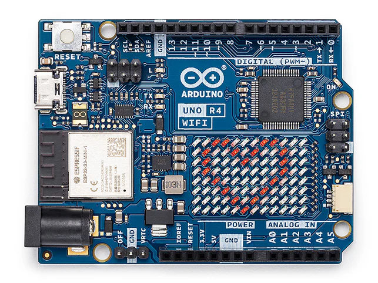

# WiFiBinaryClock

## Binary Clock Shield for Arduino

[Binary Clock Shield for Arduino][shield] is a great product that uses a colour [WS2812B NeoPixel LED][neopixel] matrix to display the time in binary format. The shield also includes a [DS3231 RTC][rtc] chip for accurate timekeeping, a [KLJ-1230 Piezo][piezo] buzzer for alarm melodies, and three buttons for setting the time and alarms. The shield is designed to be used with an Arduino UNO R3 board, but it can be used with other boards that have the same pinout headers as the UNO.  

[][shield]
___
[][shield]
___
[The Binary Clock Shield for Arduino][shield_github] is the best LED Binary Clock I know of [^1].   
The __"Nixie Tube Binary Clock"__ is the most unique and both are from the same person, Marcin Saj (https://nixietester.com).

[][NixieTube],  

[^1]: The ultimate binary clock in uniqueness has to be a [Nixie Tube Binary Clock][NixieTube]  
      [][NixieTube],  
      but that is a different project altogether that uses very old technology that predates LEDs. It's large, very power hungry, that you build yourself. You'll need to source the IN-2 Nixie Tubes yourself, buy the nixie tube power supply, build the driver circuits and PCBs. That being said, the [Binary Clock Shield for Arduino][shield] is much more pratical and portable if connected to something like an [Adafruit Metro ESP32-S3][metro] board which has a battery connection and charging circuit.
___  
This project was created to unlock the full potential of this great little Binary Clock. Being an Arduino Shield means that we can substitute the UNO R3 for something much more powerful. Initially I wanted to get my Wemos D1 R32 ESP32 UNO board to work with this shield [^2], then it could connect to any NTP server over WiFi and keep the time synced whenever we switch to/from daylight savings time. In addition we could change the colors of the LEDs and upload new alarm melodies, etc. and do it from a phone or computer. The result of this project is the [`WiFiBinaryClock`][WiFiBinaryClock] library which supports the following boards:
*   **[Arduino UNO R3][uno_r3]** - The original board that the Binary Clock Shield was designed for.
*   **[Arduino UNO R4 WiFi][r4_wifi]** - The new UNO R4 WiFi board with an ESP32-S3 module.[^3]
*   **[Arduino UNO R4 Minima][r4_minima]** - The UNO R4 Minima board without WiFi.
*   **[Adafruit Metro ESP32-S3][metro]** - The excellent Metro ESP32-S3 board with wifi, battery charging and many other features.
*   **ESP32-S3 UNO** - Generic ESP32-S3 based UNO clone boards.
*   **Wemos D1 R32 ESP32 UNO** - The original ESP32 based UNO board used for this project (required a minor [hardware modification](#hardware-modifications)).
*   **Custom UNO** - Any UNO compatible board you define in the configuration file **[`board_select.h`][boardselect]**.

[^2]: The Wemos D1 R32 ESP32 UNO board requires a minor hardware modification to work with the Binary Clock Shield, see the details in the [Hardware Modifications](#hardware-modifications) section of this document.

## **Usage:**

The user needs to define the target board being used for this code to compile. The choices are:

1.   **ESP32\_D1\_R32\_UNO** - The generic Wemos D1 R32 UNO clone board with the original ESP32-32-WROOM module.
2.   **METRO\_ESP32\_S3** - The great [Adafruit Metro ESP32-S3][metro] board.
3.   **ESP32\_S3\_UNO** - The generic UNO clone board with the new ESP32-S3 module.
4.   **UNO\_R4\_WIFI** - The new [Arduino UNO R4 WiFi][r4_wifi] board.
5.   **UNO\_R4\_MINIMA** - The [R4 Minima][r4_minima] board, no WiFi.
6.   **UNO\_R3** -  The original [Arduino UNO R3][uno_r3] board, no WiFi.
7.   **CUSTOM\_UNO** - An UNO board you define in **[`board_select.h`][boardselect]** and enable.

Add one of these defines to the compiler options (e.g. `-D METRO_ESP32_S3`) or include a preprocessor definition (e.g. `#define METRO_ESP32_S3`) in the **[`board_select.h`][boardselect]** file. The first 4 boards listed have builtin __WiFi__ [^3] so they will be able to adjust their time using SNTP over WiFi. The UNO R3 and R4 Minima do not have WiFi onboard so they are limited to time/alarm setting from the 3 buttons on the shield. If you have an UNO board that isn't listed, modify the **`CUSTOM_UNO`** board definitions in the **[`board_select.h`][boardselect]** file with the custom definitions for your board. You will need to **`#define CUSTOM_UNO true`** before the board definition section to enable the custom board.

[^3]: The UNO R4 WiFi board uses the `WiFiS3.h` library instead of the Espressif ESP32 WiFi Arduino library, some features such as WPS are not yet supported by Arduino. WiFi support for the UNO R4 WiFi board is __NOT__ included in this code. The Arduino implementation of WiFi is very different from the Espressif ESP32 Arduino implementation even though it uses an ESP32-S3 module. Given that the R4 WiFi has an onboard led matrix which a shield would coverup, not to mention the board cost, I don't know how much demand there would be to support it.

The code was developed using the excellent [PlatformIO IDE][platformio] extension for the [VSCode][vscode] editor. The file, **[`platformio.ini`][platformio_ini]**, includes the setup for each of the supported boards so all you need to do is specify which one you're using.

## **Supported Boards**

The following is a list of the boards that are directly supported by this code:   

___
*   [The Arduino UNO R3 is supported][uno_r3]  This is the original board that the Binary Clock Shield was designed for. It works well with the shield but it doesn't have WiFi so you will need to set the time and alarms using the buttons on the shield. The limited amount of memory and lack of WiFi makes this a less than ideal choice for this project.   
   [][uno_r3]  

___
*   [The Arduino UNO R4 Minima is supported][r4_minima]  This is a good board and a big improvement over the UNO R3. It doesn't have WiFi so you will need to set the time and alarms using the buttons on the shield. It does have a faster processor, more memory but at this price I'd prefer the [Adafruit Metro ESP32-S3][metro] board as it has WiFi and so much more including a battery charging circuit.   
   [][r4_minima]  
___
*   [The Arduino UNO R4 WiFi is supported][r4_wifi]  A great board and a vast improvement over the UNO R3. The addition of an ESP32-S3 module makes this a very capable board with lots of memory and two processors. The LED matrix is a great addition however, it seems like a waste to cover it up with the Binary Clock Shield. The WiFi is similar to the ESP32 WiFi except it uses `WiFiS3.h` instead and doesn't support WPS. As of the end of 2025, the **BinaryClockWiFi** library doesn't work on this board due to the differences in the WiFi libraries. This has the effect of making this board equivalent to the R4 Minima, which makes the [Adafruit Metro ESP32-S3][metro] board a much better choice.   
   [][r4_wifi]   

___
*   [The Adafruit Metro ESP32-S3 is supported][metro].  This is a great board that has so many capabilities over every other choice. The JTAG port is good for development, the micro SD Card reader is a great addition and QT I2C connector on the side means it can be used with the shield in place. This opens up many additional capabilities that can be added, such as sensors for light and human presence. The greatest feature I like for the Binary Clock Shield is the builtin battery charger circuit. The shield will keep displaying the time while you move it around or when the power goes out. **This is the board I recommend** if you want to get the most out of the Binary Clock Shield especially if you create a case for it and have it work on battery or use the battery as a bachup to the AC power.  
   [][metro]  
___
*   There are other ESP32-S3 UNO style boards, such as one based on the ESP32-S3-DevKitC-1 pinout, these work well with the Binary Clock Shield. They are available from your favorite Chinese website for under $10. This code fully supports this board, no hardware modifications are needed as the pinouts are different and the ESP32-S3 doesn't appear to have INPUT only pins. If I had created a case for the Binary Clock Shield and wanted to sell a fully functional Binary Clock powered from a USB or A/C adapter, this is the board I would use. For a version with a battery, I'd stick with the [Adafruit Metro ESP32-S3][metro].  
   

___
*   The Wemos D1 R32 ESP32 UNO. This is the board that got me started on this project. On face value it has a lot of features compared to the Arduino UNO R3, more memory and WiFi. There are key differences that make it suitable only for those who are willing to make a minor hardware modification and already have this board.  
     
   While the board is supported, it does require a minor [Hardware Modification](#hardware-modifications) to work with the shield. See the details below.

___
## Hardware Modifications  
### Wemos D1 R32 UNO

The **Binary Clock Shield for Arduino** was designed to work with the Arduino UNO R3 board, however it can be used with other boards that have the same pinout headers as the UNO. When I got my first ESP32 based UNO board, the Wemos D1 R32, I tried it with the Binary Clock Shield only to find that it didn't work. I got errors for everything, I figured out that the board used different pin number compared to the UNO R3. I made the changes to the pin numbers and I still had errors compiling, this required further investigation. The Wemos D1 R32 ESP32 based UNO type board seemed like the ideal candidate, that was until I read the datasheet. I discovered it had a hardware limitation that required a modification to the board. The shield uses UNO pin `A3` for the Neopixel LED data out pin, this pin corresponds to the ESP32 `GPIO 34` pin on the CPU which is an __input only__ pin, which means we can't use that pin. The other limitation was the builtin LED which is wired to `GPIO 02` corresponds to the UNO pin `A0`. Pin `A0` is connected to the shield for pushbutton `S3` used to set the alarm and increment values. This means we can't use the `LED_BUILTIN` LED, so we don't use the builtin LED, instead we must remap it to another pin that does nothing.

In order to get this _Wemos D1 R32_ board to work with the shield, the pin corresponding to `A3` on the shield needs to be connected to an output capable pin such as `GPIO 15`. To do this you need to physically remove the `A3/GPIO34` socket from the ESP32 UNO board (cut the plastic and desolder the pin) in order to make room, then connect the corresponding shield pin to `GPIO 15`. If you want a simpler fix, you could cut the plastic spacer on the shield corresponding to the `A3` pin and bend it in, then connect that bent pin to `GPIO 15`.


The __alternative__ is to get an Arduino UNO Development Shield and modify the development shield by bending the `A3` pin and use a Dupont connector between the bent `A3` pin and `GPIO 15` to use this output capable GPIO pin. This is the easiest but it does add some height, ~12mm or ½ inch, to the assembly.


The advantages of a development Shield are that you can add additional components, for example, you could add a LDR circuit to monitor and adjust the brightness based on ambient light and or a potentiometer to adjust the brightness.

___
## **The Software:**

  

### New Features:

The [`WiFiBinaryClock`][WiFiBinaryClock] project extended the basic capabilities of the original code:   

1. #### Added support for many different UNO boards and allowing for users to define their own board:
   1. The code continues to support the original [Arduino UNO R3][uno_r3] board.
   2. The new [Arduino UNO R4 WiFi][r4_wifi] & [Minima][r4_minima] boards.
   3. The [Adafruit Metro ESP32-S3][metro] board.
   4. The generic ESP32-S3 based UNO boards.
   5. The Wemos D1 R32 ESP32 based UNO board, which requires a minor hardware modification to work with the Binary Clock Shield.
   6. The user can define their own board by modifying the **[`board_select.h`][boardselect]** file.
   
2. #### Added full support for displaying the hours in __12 hour__ format with __AM/PM__ indicator in addition to the 24 hour format.
   1. The user can change the hour format in the Time setting menu.
   2. The alarm hours format follows the selected time hours format.
   3. The DS3231 RTC chip is set to the selected time format, so the selected format will return after the power is lost.

3. #### Changes to the User eXperience (UX) by allowing the user to exit the time and alarm settings menu without making any changes.  
   1. For time setting, the user first selects: __12__ hour; __24__ hour; or e**X**it.  
      *  The eXit is shown with a large **X** \[❌\] on the LEDs. 
      *  The __12__ hour mode is shown with the PM indicator and a binary value of 12 on the hours row.   
      *  The __24__ hour mode is shown as the binary value of 24 on the hours row.  
      *  The user presses the `S2` button as usual to save and move on to the next section.  
         *  If the user selected e**X**it, the time setting menu is aborted and no changes are made.  
         *  If the user selected __12__ hour or __24__ hour mode, the selection is saved, a large green **✓** \[✅\] is shown on the LEDs indicating a the start of the next section, setting the time.   
         *  The user continues as normal to set the hours; minutes; and seconds.
   2. For the alarm settings, the user first selects: On; oFF; or eXit.  
      *  The eXit is shown with a large red **X** \[❌\] on the LEDs.  
      *  The On is shown as a large green **O** on the LEDs.   
      *  The oFF is shown as a large red sideways **F** on the LEDs.  
   3. When the user has finished with the settings menu (Alarm or Time) the following occur:  
      *  The screen is filled with the colors of the rainbow signaling the end of the setting menu.  
      *  The result of the settings menu is displayed to the user:
         *  Success: a large green **✓** \[✅\] is shown on the LEDs indicating the changes were saved.
         *  Cancel/Abort: a large red **X** \[❌\] is shown on the LEDs indicating nothing was changed.

4. #### Added support for changing the colors of the NeoPixel LED indicators for the: hours; minutes; and seconds as well as AM and PM indicators.
   1. The user can change the ON color for each individual LED indicator as well as change the OFF color for all the LEDs.  
      *  Default ON colors are:
         *  hours = Blue \[🟦\] ;
         *  minutes = Green \[🟢\] ;
         *  seconds = Red \[🟠\] ;
         *  AM = SkyBlue <font size=4 color=skyblue>\[⬤\]</font> ;
         *  PM = Indigo \[🟣\] .
      *  Default **OFF** color is: Black \[■\] .
         *  Using any color other than black means the LED will always be ON.

5. #### Added support for playing different, user supplied, melodies for the alarms.
   1. The user can upload their own melodies and use them for the alarms.  
      *  The melody is stores as an array of `Notes` that represent the pitch and duration of each note.
         *  The pitch is stored as the frequency in Hertz (Hz) of each note.
         *  The duration is stored as the number of milliseconds (ms) each note is played.
      *  The melody is played using the `tone()` function on the UNO R3 and R4 boards.
      *  The melody is played using the `ledcWriteTone()` function on the ESP32 based boards.

6. #### Added callback handling for the Time and Alarm. This allows the `BinarClock` class to be implemented as a library and be part of another class or project.
   1. The `Time` callback is called every second when the time is updated.
   2. The `Alarm` callback is called when the alarm goes off.
   3. The callbacks remain active even when the user is in the settings menu and the time isn't being displayed on the shield.
   4. The callback handler is implemented differently depending on the board being used:
      *  For the `UNO R3` and `R4 Minima` boards, the callback is handled in the `loop()` method by checking a flag that is set in the RTC alarm interrupt service routine (ISR). On these boards the callback routine are blocking calls.
      *  For the `ESP32` based boards running `FreeRTOS`, the callback is handled in a separate task. The task waits for a notification from the `BinaryClock::timeDispatch()` method and calls the `Time` or `Alarm` callback routines from its own thread.

7. #### Added error handling for critical errors where the program can't continue such as not being able to communicate with the RTC chip.
   1. The error handling consists of displaying an error code on a LED on the board such as the builtin LED.
   2. Watchdog time is triggered after ~2.1 seconds has elapsed without an update.
   3. Instead of using some custom code of blinking LEDs, I decided to have some fun and use Morse code to display the error code. My first instinct was to flash SOS, but I learned that this is not cool. SOS is reserved for an actual human life threatening distress signal and must __NEVER__ be used for anything else. So I decided to write a Morse Code class to blink the message on the LEDs. I also took the opertunity to see what AI (in this case CoPilot) could come up with and it did a mixed job. The encoding of the Morse code was a good idea from CoPilot but then it couldn't get the codes correct for all letters, numbers and punctuation. It also wrote lots of duplicate code in the methods and the code wasn't at all robust. It was an educational experience, you need to have experience or CoPilot will lead you down the garden path.
      *  The error code is displayed as a series of Morse code blinks on the LED. The SOS is **NOT** used as this is an actual life critical distress signal. **CQD** is used instead, which stands for "Come Quick Distress" [^4]. This is the original distress signal, from the early 1900s, that was fully replaced by SOS after the sinking of the Titanic. **CQD** is probably a good choice when it isn't an actual life critical distress that needs to be communicated.
         *  The default message, when the program enters the `purgatoryTask()` is **CQD NO RTC** in Morse code. This stands for "Come Quick Distress NO Real Time Clock" [^4].
         *  The UNO R3 can only play this message as it doesn't have enough memory to store the codes needed for additional messages. All other boards can blink any message in Morse code on the assigned LED. The default is to use the `LED_BUILTIN` LED on the board, however it can be changed to any other LED pin.   
      *  The Morse code is implemented from the [`MorseCodeLED`][MorseCodeLED_lib] library and class in the [`MorseCodeLED.h`][MorseCodeLED] and [`MorseCodeLED.cpp`][MorseCodeLED_cpp] files.

8. #### Added WiFi support for the ESP32 based boards using the [`BinaryClockWiFi`][BinaryClockWiFi_lib] library.
   *  The WiFi support includes:  
      1. Connecting to a WiFi access point using stored credentials from the NVS (Non-Volatile Storage).  
         *  This functionality is handled using the [`BinaryClockSettings`][BinaryClockSettings] class.
      2. Using WPS to connect to a WiFi access point if the local Access Points (AP) don't match the credentials stored in NVS.  
         *  This functionality is handled using the [`BinaryClockiWPS`][BinaryClockWPS] class.
      3. Getting the time from an NTP server and adjusting for daylight savings time automatically for the given timezone.  
         *  This functionality is handled using the [`BinaryClockNTP`][BinaryClockNTP] class.lity is 
      4. Saving the WiFi credentials and user settings to NVS so they are retained after a power cycle.  
         *  This functionality is handled using the [`BinaryClockSettings`][BinaryClockSettings] class.
      5. Handling WiFi events such as connection and disconnection and trying to reconnect.   
      6. The WiFi functionality is implemented in its own class, [`BinaryClockWAN`][BinaryClockWAN].   

[^4]: The actual meaning of **CQD** is "General Call to All Stations - Distress". The general public, not being Morse code operators, assigned __CQ__ to be short for __Come Quick__ instead of its actual meaning. The letters "CQ" are used in Morse code to signal a general call to all stations, similar to saying "Attention all stations". In the 19<sup>th</sup> century, the addition of "D" indicated that the message was a distress signal. So **CQD** was used to indicate a distress call to all stations. In 1906 the distress signal was changed to **SOS** which is easier to recognize in Morse code: 3 dots, 3 dashes, 3 dots. The use of **CQD** was phased out after the Titanic disaster in 1912, where it had been used alongside **SOS**. After that, **SOS** became the standard distress signal and **CQD** was no longer used for distress calls. The general public still likes to assign meaning to the letters __SOS__ and assigned meanings such as "Save Our Souls" or "Save Our Ship." These are backronyms and were never the original meaning of the signal which is a short, easy to remember code that everyone could understand. The **SOS** signal is reserved for use __ONLY__ in cases of immediate threat to human lives and not for anthing else.
___
### Background:

The software was initially based on the [example/11-BinaryClockRTCInterruptAlarmButtons][example_11] on the GitHub [marcinsaj/Binary-Clock-Shield-for-Arduino][shield_github]. I refactored everything to create a pure Interface class, [`IBinaryClock`][IBinaryClock], to fix the minimum capabilities and decouple the classes. The main [`BinaryClock`][BinaryClock] class implements the interface and handles all the base operations of the Binary Clock Shield. The class would perform everything related to the Binary Clock Shield, such as handling the display of the time, alarm and interface screens on the NeoPixel LED matrix. Additional classes were created to handle the button pressing and debouncing, serial output and settings menu. The [`BCMenu`][BCMenu] class handles all the settings menu operations. This class contains most of the settings logic and methods, modified to work in a class with the new user interface. The [`BCButtons`][BCButton] class handles all the button pressing and debouncing. The [`SerialOutput.Defines.h`][SerialOutputDefines] file defines all the serial output MACROs, this is useful for debugging and can be disabled with a simple _#define_ to remove the code and save memory. The [`MorseCodeLED`][MorseCodeLED] class handles the Morse code blinking on an LED for error codes. The [`BinaryClockWAN`][BinaryClockWAN] class handles all the WiFi operations, such as connecting to an access point, getting the time from an NTP server and uploading new alarm melodies. The [`BinaryClock`][BinaryClock] class uses the [Adafruit Bus IO][busio] library; a forked version of the [Adafruit RTClib][rtclib] library, [RTClibPlus][rtclibplus]; and the [FastLED][fastled] library.

The [`BinaryClock`][BinaryClock] class was designed to be used as part of a library so it could be included in another project. The class uses callback functions to notify the main program when the time is updated or when an alarm goes off. This allows the main program to handle these events as needed. The main program could be altered for the different board capabilities, or lack of capabilities. The Arduino UNO R3 and R4 Minima boards don't have WiFi so they are limited to setting the time and alarms using the buttons on the shield. The ESP32 based boards have WiFi so they can connect to an NTP server to get the time and adjust for daylight savings time automatically. The ESP32 based boards can also be used to change the LED colors and upload new alarm melodies. The WiFi capabilities are not part of the [`BinaryClock`][BinaryClock] library class, they are handled in their own library, [`BinaryClockWiFi`][BinaryClockWiFi_lib]. The [`BinaryClock.Defines.h`][BinaryClockDefines] file contains all the global definitions for the different boards, their capabilities, and other defines used in the code. The main program can use these definitions to enable or disable features based on the board being used. The [`board_select.h`][boardselect] file can be used to define the pin assignments and board capabilities for any UNO style board not currently supported. The [`BinaryClock.Structs.h`][BinaryClockStructs] file contains all the global data structures used in the library.

___
### Design Overview:

The **`WiFiBinaryClock`** Project is designed to be modular and extensible, allowing it to be easily integrated into different projects and platforms. The main library, [`BinaryClock`][BinaryClock_lib] is structured around a core set of classes that handle the various aspects of the binary clock functionality, including timekeeping, alarm management, and user interactions. The [`BinaryClockWiFi`][BinaryClockWiFi_lib] library is designed to handle all the WiFi related functionality, such as connecting to an access point, getting the time from an NTP server and uploading new alarm melodies. This library also provides a way to manage the WiFi connection, including WPS and credential setting and management through a web page, saving the credentials and user settings to NVS, and handle any related events. The [`RTClibPlus`][RTClibPlus_lib] library is a forked version of the popular [Adafruit RTClib library][rtclib] with expanded functionality. The [`MorseCodeLED`][MorseCodeLED_lib] library handles the Morse code blinking on an LED for error codes and is designed to be used independently of the Binary Clock library.

#### The main components of the [`BinaryClock`][BinaryClock_lib] library include:  

0. **[`IBinaryClock`][IBinaryClock]**: An interface class that defines the core functionality of the binary clock. This class provides a common interface for different implementations of the binary clock, and providing a consistent API for interacting with the clock.   
     This provides a level of decoupling that makes testing of the components easier.   
     The Interface class, by design, allows passing an implementing class to the sub-classes without creating circular dependencies.   
     This class is defined in the [`IBinaryClock.h`][IBinaryClock] file.

1. **[`BinaryClock`][BinaryClock]**: The primary class, inherits from the interface class [`IBinaryClock.h`][IBinaryClock], it manages the overall functionality of the binary clock.   
     It handles timekeeping, alarm management, and user interactions through button presses. It also manages the display of the time and alarm status on the LED matrix.   
     This class is responsible for coordinating the various components of the binary clock and providing a unified interface for users to interact with the clock.   
     This class is defined in the [`BinaryClock.h`][BinaryClock] and [`BinaryClock.cpp`][BinaryClock_cpp] files.

2. **[`BCButton`][BCButton]**: A class that abstracts the button functionality, providing a consistent interface for reading button states and managing button presses.   
     This class is responsible for debouncing button presses and translating them into meaningful actions within the binary clock.   
     This class is defined in the [`BCButton.h`][BCButton] and [`BCButton.cpp`][BCButton_cpp] files.

3. **[`BCMenu`][BCMenu]**: A class that manages the settings and configuration of the binary clock. This class is responsible for storing and retrieving user preferences, such as time format and alarm settings.   
     It provides a consistent interface for accessing and modifying the clock's configuration.   
     This class is defined in the [`BCMenu.h`][BCMenu] and [`BCMenu.cpp`][BCMenu_cpp] files.

4. **[`BinaryClock.Defines.h`][BinaryClockDefines]**: A header file that contains all the preprocessor definitions for the different boards and their capabilities. This file is used to configure the library for different hardware platforms and enable or disable features based on the board being used.  
     This header file is used by every class to simplify the code for all the different boards and configurations.  Defines and MACROs are used to manage the selective code used throughout the library based on the board being used and the configuration.  
     Custom board definitions and configurations are possible using the [`board_select.h`][boardselect] file where the user can define a `CUSTOM_UNO` board that will be used instead of any predefined board. If this file exists, it is automatically included at the start of the [`BinaryClock.Defines.h`][BinaryClockDefines] file overriding the predefined board definitions.   
       This file is located at ['./lib/BinaryClock/src/BinaryClock.Defines.h'][BinaryClockDefines].

5. **[`BinaryClock.Structs.h`][BinaryClockStructs]**: A header file that contains all the global data structures used in the library. This file defines the various data structures used to represent time, alarms, and other settings within the binary clock.  
     This file is located at ['./lib/BinaryClock/src/BinaryClock.Structs.h'][BinaryClockStructs].

6. **[`SerialOutput.Defines.h`][SerialOutputDefines]**: A header file that contains all the serial output MACROs used for debugging and logging. This file provides a way to enable or disable serial output throughout the library, allowing for easy debugging and troubleshooting. The output code can be removed by just defining or undefining the relevant MACROs reducing the final code size.  
     This file is located at ['./lib/BinaryClock/src/SerialOutput.Defines.h'][SerialOutputDefines].       

#### The main components of the [`BinaryClockWiFi`][BinaryClockWiFi_lib] library include:

0. **[`BinaryClockWAN`][BinaryClockWAN]**: A class that handles all the WiFi operations for the binary clock. This class is responsible for connecting to a WiFi access point, getting the time from an NTP server, and uploading new alarm melodies.  
     The class also provides a way to manage the WiFi connection, including WPS and credential setting and management through a web page, saving the credentials and user settings to NVS, and handle any related events.  
     This class is defined in the [`BinaryClockWAN.h`][BinaryClockWAN] and [`BinaryClockWAN.cpp`][BinaryClockWAN_cpp] files.

1. **[`BinaryClockWPS`][BinaryClockWPS]**: A class that handles the WPS operations for the binary clock. This class is responsible for initiating the WPS process and managing the connection to the WiFi access point using WPS.  
     This class is defined in the [`BinaryClockWPS.h`][BinaryClockWPS] and [`BinaryClockWPS.cpp`][BinaryClockWPS_cpp] files.

2. **[`BinaryClockNTP`][BinaryClockNTP]**: A class that handles the NTP operations for the binary clock. This class is responsible for getting the time from an NTP server and updating the binary clock's time accordingly.  
     This class is defined in the [`BinaryClockNTP.h`][BinaryClockNTP] and [`BinaryClockNTP.cpp`][BinaryClockNTP_cpp] files. 

3. **[`BinaryClockSettings`][settings]**: A class that manages the WiFi settings and configuration of the binary clock. This class is responsible for storing and retrieving user preferences related to WiFi, such as SSID and password.   
     It provides a consistent interface for accessing and modifying the WiFi configuration.   
     This class is defined in the [`BinaryClockSettings.h`][settings] and [`BinaryClockSettings.cpp`][settings_cpp] files.

#### The main components of the [`MorseCodeLED`][MorseCodeLED_lib] library include:

0. **[`MorseCodeLED`][MorseCodeLED]**: A class that handles the Morse code blinking on an LED for error codes. This class is responsible for encoding messages into Morse code and controlling the LED to blink the corresponding dots and dashes.  
     The class was created to provide visual feedback for error states in the binary clock when the shield components fail, such as the Real Time Clock or NeoPixel LEDs. This typically occurs when the Binary Clock Shield is not connected to the UNO board, so a visual indication is needed to alert the user.  
     To avoid looking like a blinky sketch is installed, a more sophisticated error handling mechanism is used, the use Morse code on the LED. While 99.999% of people won't be able to understand it directly, it does indicate to the user that a message is being conveyed.   
     This class is defined in the [`MorseCodeLED.h`][MorseCodeLED] and [`MorseCodeLED.cpp`][MorseCodeLED_cpp] files.

## **Note:**

This code uses a forked version of [Adafruit's RTClib library][rtclib] (see the forked [`./lib/RTClibPlus/README.md`][readme_rtc] file for more information).   
The forked library is called [`RTCLibPlus`][RTCLibPlus_lib] and is also available on GitHub at [`https://github.com/Chris-70/RTClibPlus`][RTClibPlus]. It has been modified to:

*   Make the inherited base class `RTC_I2C` public for the `RTC_DS3231` class (and all other child classes), e.g. `class RTC_DS3231 : public RTC_I2C`.
*   It removes the DS3231 interrupt enable check (register 0x0E, bit: 4) when setting alarms. This check has no reason to be there as setting the alarm time on the DS3231 chip is independent of the interrupt setting.  
   The Binary Clock makes use of the SQW pin for the 1 Hz signal, this is the same physical pin as the alarm interrupt pin.   
   The Binary Clock needs to set the alarm time values as the code checks for the alarm without needing the interrupt pin. This allows the rest of the code to set the alarm time registers.  
   In the methods: `bool RTC_DS3231::setAlarm1(const DateTime &dt, Ds3231Alarm1Mode alarm_mode)` and `bool RTC_DS3231::setAlarm2(const DateTime &dt, Ds3231Alarm1Mode alarm_mode)`, the removed code was:  
```cpp
//   if (!(ctrl & 0x04)) {
//     return false;
//   }
```

*   An additional `toString()` method was added to the `DateTime` class, `char* toString(char* buffer, size_t size, const char *format) const;`.  
   This method takes the `format` string and copies it to the `buffer` before calling `char *toString(char *buffer) const;` allowing the method to be used inline without the need to format the buffer first.  
   Example: 
   ```cpp
   Serial << time.toString(buffer, 31, "hh:mm AP on DDD. MMM. DD, YYYY");
   // e.g. For 2024-07-19T09:15:00 would display: "09:15 AM on Fri. Jul. 19, 2024"
   ```
   instead of needing two lines: 
   ```cpp
   strncpy(buffer, "HH:mm AP on DDD. MMM. DD, YYYY", 32); 
   Serial << time.toString(buffer);
   // e.g. For 2022-08-05T13:30:00 would display: " 1:30 PM on Fri. Aug. 05, 2022"
   ```
*   The string format was expanded to include:
   *   `hh` - hours with    a leading zero:` "01" - 12, "00" - 23 `   _(Original)_
   *   `HH` - hours without a leading zero:` " 1" - 12, " 0" - 23 `   _(New)_
   *   `AP` - AM/PM indicator: `"AM" or "PM"`                         _(New)_

#### Additional features were added to [`RTCLibPlus`][RTCLibPlus_lib]:

1. Added full support for 12 hour mode on the `DS3231` and `DS1307` RTC chips. These chips support __12__ hour mode but the original `RTClib` library didn't implement it.  
   *  The `DateTime` class was modified to support reading and writing the 12 hour mode to/from the RTC chips. The `DateTime` class was modified to support reading and writing the 12 hour mode to/from the RTC chips.  
   *  The `DateTime` constructor was modified to accept a new parameter, `is12HourFormat`, which defaults to `false` (24 hour mode).  
   *  The `RTC_DS3231::adjust()` and `RTC_DS1307::adjust()` methods were modified to write the 12 hour mode to the RTC chips if the `is12HourFormat()` returns `true` or if the optional parameter `use12HourFormat` is set to `true`.
2. Added full support to set the __starting day of the week__ in the `DateTime` class at compile time. The original implementation defined May 1st, 2000 as the epoch for calculating the weekday as this date was a Monday.   
   *  This was extended this concept to match every day of the week with the first corresponding month in the year 2000 where the 1st fell on that weekday.  
      This matches the weekday with the RTC that doesn't define a starting weekday just that they are consecutive from 1 - 7 (0 - 6 in DateTime). 
   *  The developer just needs to modify the `#define FIRST_WEEKDAY "Mon"` line in the [`DateTime.h`][datetime_h] file to the desired starting weekday.  
      The choices are: `"Mon"`, `"Tue"`, `"Wed"`, `"Thu"`, `"Fri"`, `"Sat"`, and `"Sun"`. The default is `"Mon"` which matches the original implementation.  
3. The [`DateTime`][datetime_h] and [`TimeSpan`][datetime_h] classes were extracted from the [`RTClib.h`][rtclib_h] file into a separate header file, [`DateTime`][datetime_h], to allow easier inclusion in other classes without needing to include the entire `RTClib.h` file.  
   *  The `DateTime` and `TimeSpan` classes were moved to the `DateTime.h` file.  
   *  The `RTClib.h` file now includes the `DateTime.h` file to maintain compatibility with existing code that includes `RTClib.h`.

A fork of the `RTCLib`, `RTCLibPlus`, is available ([https://github.com/Chris-70/RTClibPlus][RTClibPlus]) while the pull request, # 313, for `RTClib` is pending.

___
## License

The WiFiBinaryClock software, Copyright (c) 2025 Chris-70 and Chris-80, are licensed under the GNU General Public License v3.0 (GPL-v3.0).  
You may obtain a copy of the License at: [https://www.gnu.org/licenses/gpl-3.0.en.html][gpl_3] (see [**LICENSE**][license] file).  
Parts of the [`BCMenu`][BCMenu] class are Copyright (c) 2018 Marcin Saj and also released under the GPL-v3.0 license.

## **Acknowledgements:**
*   Marcin Saj, the original creator of the [Binary Clock Shield for Arduino][shield] and the author of the [Binary-Clock-Shield-for-Arduino GitHub repository][shield_github].
*   [Adafruit][adafruit] for their excellent [RTClib library][rtclib], their commitment to open source hardware and software and the numerous libraries, [Adafruit Repositories][adafruit_github], and all the software they provide to the community.   
   Their contribution to education and teaching with [Adafruit Learning System][adafruit_learn] needs to be acknowledged as well. They are a great example of how companies can to do open source hardware and software right.
*   FastLED community for their excellent [FastLED library][fastled].
*   Janelia for their excellent [Janelia Arduino Streaming library][streaming].
*   Arduino community for their excellent [Arduino IDE][arduino_ide] and [Arduino CLI][arduino_cli] tools.
*   PlatformIO community for their excellent [PlatformIO IDE][platformio] extension for VSCode.
*   Everyone in the open source community who contributes to the libraries and tools that make projects like this possible.

## Contact Information:
*   Chris-70:
      *   GitHub: [https://github.com/Chris-70][Chris-70]
*   Chris-80:
      *   GitHub: [https://github.com/Chris-80][Chris-80]

___

[adafruit]: https://www.adafruit.com/
[adafruit_github]: https://github.com/adafruit
[adafruit_learn]: https://learn.adafruit.com/
[arduino_cli]: https://arduino.github.io/arduino-cli/latest/
[arduino_ide]: https://www.arduino.cc/en/software
[BCButton]: https://github.com/Chris-70/WiFiBinaryClock/tree/main/lib/BinaryClock/src/BCButtons.h
[BCButton_cpp]: https://github.com/Chris-70/WiFiBinaryClock/tree/main/lib/BinaryClock/src/BCButtons.cpp
[BCMenu]: https://github.com/Chris-70/WiFiBinaryClock/tree/main/lib/BinaryClock/src/BCMenu.h
[BCMenu_cpp]: https://github.com/Chris-70/WiFiBinaryClock/tree/main/lib/BinaryClock/src/BCMenu.cpp
[BinaryClock_lib]: https://github.com/Chris-70/WiFiBinaryClock/tree/main/lib/BinaryClock/src
[BinaryClock]: https://github.com/Chris-70/WiFiBinaryClock/tree/main/lib/BinaryClock/src/BinaryClock.h
[BinaryClock_cpp]: https://github.com/Chris-70/WiFiBinaryClock/tree/main/lib/BinaryClock/src/BinaryClock.cpp
[IBinaryClock]: https://github.com/Chris-70/WiFiBinaryClock/tree/main/lib/BinaryClock/src/IBinaryClock.h
[BinaryClockDefines]: https://github.com/Chris-70/WiFiBinaryClock/tree/main/lib/BinaryClock/src/BinaryClock.Defines.h
[BinaryClockStructs]: https://github.com/Chris-70/WiFiBinaryClock/tree/main/lib/BinaryClock/src/BinaryClock.Structs.h
[BinaryClockWiFi_lib]: https://github.com/Chris-70/WiFiBinaryClock/tree/main/lib/BinaryClockWiFi/src
[BinaryClockNTP]: https://github.com/Chris-70/WiFiBinaryClock/tree/main/lib/BinaryClockWAN/src/BinaryClockNTP.h
[BinaryClockNTP_cpp]: https://github.com/Chris-70/WiFiBinaryClock/tree/main/lib/BinaryClockWAN/src/BinaryClockNTP.cpp
[BinaryClockSettings]: https://github.com/Chris-70/WiFiBinaryClock/tree/main/lib/BinaryClock/src/BinaryClockSettings.h
[BinaryClockSettings_cpp]: https://github.com/Chris-70/WiFiBinaryClock/tree/main/lib/BinaryClock/src/BinaryClockSettings.cpp
[BinaryClockWAN]: https://github.com/Chris-70/WiFiBinaryClock/tree/main/lib/BinaryClockWAN/src/BinaryClockWAN.h
[BinaryClockWAN_cpp]: https://github.com/Chris-70/WiFiBinaryClock/tree/main/lib/BinaryClockWAN/src/BinaryClockWAN.cpp
[BinaryClockWPS]: https://github.com/Chris-70/WiFiBinaryClock/tree/main/lib/BinaryClockWAN/src/BinaryClockWPS.h
[BinaryClockWPS_cpp]: https://github.com/Chris-70/WiFiBinaryClock/tree/main/lib/BinaryClockWAN/src/BinaryClockWPS.cpp
[boardselect]: https://github.com/Chris-70/WiFiBinaryClock/tree/main/lib/BinaryClock/src/board_select.h
[busio]: https://github.com/adafruit/Adafruit_BusIO
[Chris-70]: https://github.com/Chris-70
[Chris-80]: https://github.com/Chris-80
[datetime_h]: https://github.com/Chris-70/WiFiBinaryClock/tree/main/lib/RTClibPlus/src/DateTime.h
[example_11]: https://github.com/marcinsaj/Binary-Clock-Shield-for-Arduino/tree/master/example/11-BinaryClockRTCInterruptAlarmButtons
[fastled]: https://github.com/FastLED/FastLED
[fastled]: https://github.com/FastLED/FastLED
[gpl_3]: https://www.gnu.org/licenses/gpl-3.0.en.html
[IBinaryClock]: https://github.com/Chris-70/WiFiBinaryClock/tree/main/lib/BinaryClock/src/IBinaryClock.h
[license]: https://github.com/Chris-70/WiFiBinaryClock/blob/main/lib/BinaryClock/src/LICENSE
[metro]: https://www.adafruit.com/product/5500
[MorseCodeLED_lib]: https://github.com/Chris-70/WiFiBinaryClock/tree/main/lib/MorseCodeLED/src
[MorseCodeLED]: https://github.com/Chris-70/WiFiBinaryClock/tree/main/lib/MorseCodeLED/src/MorseCodeLED.h
[MorseCodeLED_cpp]: https://github.com/Chris-70/WiFiBinaryClock/tree/main/lib/MorseCodeLED/MorseCodeLED.cpp
[neopixel]: https://www.adafruit.com/product/1655
[NixieTube]: https://nixietester.com/project/in-2-binary-nixie-clock/
[piezo]: https://www.keliking.com/KLJ-1230-SMD-Piezo-Buzzer-pd6204765.html
[platformio]: https://platformio.org/
[platformio_ini]: https://github.com/Chris-70/WiFiBinaryClock/blob/main/platformio.ini
[r4_minima]: https://store.arduino.cc/collections/uno/products/uno-r4-minima
[r4_wifi]: https://store.arduino.cc/collections/uno/products/uno-r4-wifi
[readme_rtc]: https://github.com/Chris-70/WiFiBinaryClock/tree/main/lib/RTClibPlus/README.md
[rtc]: https://www.analog.com/en/products/ds3231.html
[rtclib]: https://github.com/adafruit/RTClib
[rtclib_h]: https://github.com/Chris-70/WiFiBinaryClock/tree/main/lib/RTClibPlus/src/RTClib.h
[RTClibPlus_lib]: https://github.com/Chris-70/WiFiBinaryClock/tree/main/lib/RTClibPlus/srcW
[RTClibPlus]: https://github.com/Chris-70/RTClibPlus
[SerialOutputDefines]: https://github.com/Chris-70/WiFiBinaryClock/tree/main/lib/BinaryClock/src/SerialOutput.Defines.h
[settings]: https://github.com/Chris-70/WiFiBinaryClock/tree/main/lib/BinaryClockWAN/src/BinaryClockSettings.h
[settings_cpp]: https://github.com/Chris-70/WiFiBinaryClock/tree/main/lib/BinaryClockWAN/src/BinaryClockSettings.cpp
[shield_github]: https://github.com/marcinsaj/Binary-Clock-Shield-for-Arduino
[shield]: https://nixietester.com/product/binary-clock-shield-for-arduino/
[streaming]: https://github.com/janelia-arduino/Streaming
[uno_r3]: https://store.arduino.cc/collections/uno/products/arduino-uno-rev3
[vscode]: https://code.visualstudio.com/
[WiFiBinaryClock]: https://github.com/Chris-70/WiFiBinaryClock
