# BCGlobalDefines Library - Class Diagram

This library provides global type definitions, interfaces, template classes, structures, and macros used throughout the Binary Clock project.

## Additional Documents
- [**`README.md`**][README] (GitHub: [`README.md`][README_Git]) - Overview and description of the **BCGlobalDefines library**.
- [**`InstallUsage.md`**][InstallUsage] (GitHub: [`InstallUsage.md`][InstallUsage_Git]) - Installation and usage instructions for the **BCGlobalDefines library**.
---

```mermaid
classDiagram
    %% ========================================
    %% INTERFACES
    %% ========================================
    
    class IBinaryClockBase {
        <<interface>>
        +set_Time(DateTime)
        +get_Time() DateTime
        +set_Alarm(AlarmTime)
        +get_Alarm() AlarmTime
        +get_TimeFormat() char*
        +get_AlarmFormat() char*
        +set_Is12HourFormat(bool)
        +get_Is12HourFormat() bool
        +get_IsSerialTime() bool
        +get_IsSerialSetup() bool
        +get_S1TimeDec() IBCButtonBase&
        +get_S2SaveStop() IBCButtonBase&
        +get_S3AlarmInc() IBCButtonBase&
        +get_IdName() char*
        +RegisterTimeCallback(callback) bool
        +UnregisterTimeCallback(callback) bool
        +RegisterAlarmCallback(callback) bool
        +UnregisterAlarmCallback(callback) bool
        +DisplayBinaryTime(int, int, int, bool)
        +DisplayLedPattern(LedPattern)
        +PlayAlarm(AlarmTime) const
        +ReadTime() DateTime
    }
    click IBinaryClockBase href "https://github.com/Chris-70/WiFiBinaryClock/blob/main/lib/BCGlobalDefines/src/IBinaryClockBase.h"

    class IBinaryClock {
        <<interface>>
        +DisplayLedPattern(LedPattern, unsigned long)
        +PlayMelody(size_t id) bool
        +RegisterMelody(vector~Note~&) size_t
        +GetMelodyById(size_t) vector~Note~&
    }
    click IBinaryClock href "https://github.com/Chris-70/WiFiBinaryClock/blob/main/lib/BCGlobalDefines/src/IBinaryClock.h"

    class IBCButtonBase {
        <<interface>>
        +CC_ON$ uint8_t
        +CA_ON$ uint8_t
        +Initialize()
        +IsPressed() bool
        +IsPressedRaw() bool
        +IsPressedNew() bool
        +ClearPressedNew()
        +Reset()
        +get_Pin() uint8_t
        +get_Value() uint8_t
        +get_OnValue() uint8_t
        +get_IsFirstRead() bool
        +get_LastReadTime() unsigned long
    }
    click IBCButtonBase href "https://github.com/Chris-70/WiFiBinaryClock/blob/main/lib/BCGlobalDefines/src/IBCButtonBase.h"

    %% ========================================
    %% TEMPLATE CLASSES
    %% ========================================
    
    class TaskWrapper~T~ {
        <<template>>
        +CreateInstanceTask$(obj, method, name, stack, priority, core, params, handle) BaseType_t
        +CreateStaticTask$(method, name, stack, priority, core, params, handle) BaseType_t
        -TaskProxyInstance$(params)$ void
        -TaskProxyStatic$(params)$ void
    }
    click TaskWrapper href "https://github.com/Chris-70/WiFiBinaryClock/blob/main/lib/BCGlobalDefines/src/TaskWrapper.h"

    class TaskGroupBits~BitsType, BitIndexType~ {
        <<template>>
        -eventGroupHandle : EventGroupHandle_t
        -bitMask : BitsType
        +TaskGroupBits(bitIndex)
        +~TaskGroupBits()
        +SetBit() BaseType_t
        +ClearBit() BaseType_t
        +WaitForBit(ticksToWait) bool
        +WaitForBit(ticksToWait, clearOnExit) bool
        +GetBit() bool
        +GetEventGroupHandle() EventGroupHandle_t
    }
    click TaskGroupBits href "https://github.com/Chris-70/WiFiBinaryClock/blob/main/lib/BCGlobalDefines/src/TaskGroupBits.h"

    %% ========================================
    %% STRUCTURES
    %% ========================================
    
    class AlarmTime {
        <<struct>>
        +hour : byte
        +minute : byte
        +status : byte
        +melody : size_t
        +AlarmTime()
        +AlarmTime(h, m)
        +AlarmTime(h, m, s)
        +AlarmTime(h, m, s, mel)
    }
    click AlarmTime href "https://github.com/Chris-70/WiFiBinaryClock/blob/main/lib/BCGlobalDefines/src/BinaryClock.Structs.h"

    class Note {
        <<struct>>
        +frequency : int
        +duration : int
        +Note()
        +Note(freq, dur)
        +operator==(other) bool
    }
    click Note href "https://github.com/Chris-70/WiFiBinaryClock/blob/main/lib/BCGlobalDefines/src/BinaryClock.Structs.h"

    class APNames {
        <<struct>>
        +apMac : uint8_t[6]
        +apName : String
        +APNames()
        +APNames(mac, name)
        +MacToString(mac)$ String
        +StringToMac(str, mac)$ bool
        +ValidateMac(mac)$ bool
        +operator==(other) bool
        +SetMac(mac)
    }
    click APNames href "https://github.com/Chris-70/WiFiBinaryClock/blob/main/lib/BCGlobalDefines/src/BinaryClock.Structs.h"

    class WiFiInfo {
        <<struct>>
        +ssid : String
        +channel : int32_t
        +rssi : int32_t
        +encryptionType : wifi_auth_mode_t
        +WiFiInfo()
        +WiFiInfo(ssid, mac, apName, channel, rssi, encryption)
        +operator==(other) bool
        +AuthToString(authMode)$ String
    }
    click WiFiInfo href "https://github.com/Chris-70/WiFiBinaryClock/blob/main/lib/BCGlobalDefines/src/BinaryClock.Structs.h"

    class APCreds {
        <<struct>>
        +ssid : String
        +password : String
        +APCreds()
        +APCreds(ssid, pwd, mac, apName)
        +operator==(other) bool
    }
    click APCreds href "https://github.com/Chris-70/WiFiBinaryClock/blob/main/lib/BCGlobalDefines/src/BinaryClock.Structs.h"

    class APCredsPlus {
        <<struct>>
        +priority : uint8_t
        +APCredsPlus()
        +APCredsPlus(ssid, pwd, mac, apName, priority)
        +operator==(other) bool
    }
    click APCredsPlus href "https://github.com/Chris-70/WiFiBinaryClock/blob/main/lib/BCGlobalDefines/src/BinaryClock.Structs.h"

    %% ========================================
    %% ENUMERATIONS
    %% ========================================
    
    class LedPattern {
        <<enumeration>>
        AllOff
        AllOn
        AllRed
        AllGreen
        AllBlue
        Rainbow
        CheckMarkGreen
        %%WiFi_patterns_start
        XMarkPink
        WiFiSymbol
        WiFiSymbolBlue
        HourGlass
        %%WiFi_patterns_end
    }
    click LedPattern href "https://github.com/Chris-70/WiFiBinaryClock/blob/main/lib/BCGlobalDefines/src/BinaryClock.Structs.h"

    %% ========================================
    %% MACRO SYSTEMS (Documentation Only)
    %% ========================================
    
    class SerialOutputMacros {
        <<utility>>
        SERIAL_OUTPUT
        SERIAL_SETUP_CODE
        SERIAL_TIME_CODE
        DEBUG_OUTPUT
        PRINTF_OK
        Note: Conditional compilation macros
    }
    click SerialOutputMacros href "https://github.com/Chris-70/WiFiBinaryClock/blob/main/lib/BCGlobalDefines/src/SerialOutput.Defines.h"

    class BoardConfigMacros {
        <<utility>>
        ESP32_D1_R32_UNO
        METRO_ESP32_S3
        ESP32_S3_UNO
        UNO_R4_WIFI
        UNO_R4_MINIMA
        UNO_R3
        Pin definitions
        System constants
        Note: 900+ lines of board-specific configurations
    }
    click BoardConfigMacros href "https://github.com/Chris-70/WiFiBinaryClock/blob/main/lib/BCGlobalDefines/src/BinaryClock.Defines.h"

    %% ========================================
    %% RELATIONSHIPS
    %% ========================================
    
    IBinaryClock --|> IBinaryClockBase : extends
    
    WiFiInfo --|> APNames : extends
    APCreds --|> APNames : extends
    APCredsPlus --|> APCreds : extends
    
    IBinaryClockBase ..> AlarmTime : uses
    IBinaryClockBase ..> IBCButtonBase : references
    IBinaryClockBase ..> LedPattern : uses
    IBinaryClock ..> Note : uses
    
    AlarmTime ..> Note : melody reference
```

## Library Overview

### Purpose
The **BCGlobalDefines** library provides the foundational building blocks for the Binary Clock project:
- **Interfaces**: Define contracts for clock and button implementations
- **Template Classes**: Provide FreeRTOS task management utilities
- **Structures**: Define data types for alarms, melodies, and WiFi credentials
- **Enumerations**: Define LED patterns and other constants
- **Macros**: Provide board-specific configurations and conditional compilation

### Key Components

#### Interfaces
1. **IBinaryClockBase** - Core clock interface with 25+ methods for time/alarm management, LED display, and callbacks
2. **IBinaryClock** - Extended interface adding melody registry and enhanced LED pattern methods (requires STL)
3. **IBCButtonBase** - Button interface with debouncing, state management, and support for CC/CA wiring

#### Template Classes
1. **TaskWrapper\<T\>** - Creates FreeRTOS tasks from instance or static methods (C++14+)
2. **TaskGroupBits\<BitsType, BitIndexType\>** - Manages FreeRTOS EventGroup bits with type safety

#### Data Structures
1. **AlarmTime** - Alarm configuration (hour, minute, status, melody ID)
2. **Note** - Musical note (frequency, duration)
3. **WiFi Hierarchy**:
   - `APNames` - Base: MAC address and AP name
   - `WiFiInfo` - Adds: SSID, channel, RSSI, encryption
   - `APCreds` - Adds: SSID and password
   - `APCredsPlus` - Adds: priority for connection ordering

#### Enumerations
- **LedPattern** - Predefined LED display patterns (7 base + 4 WiFi-specific)

#### Macro Systems
1. **SerialOutput.Defines.h** - Controls serial output compilation
2. **BinaryClock.Defines.h** - Board configurations for 6+ UNO-style boards with pin mappings

### Dependencies
- **FreeRTOS**: Template classes require FreeRTOS for task management
- **Arduino Core**: All components depend on Arduino.h
- **RTClib**: DateTime class used in interfaces
- **STL** (optional): IBinaryClock requires `<vector>` for melody registry

### Usage Notes
- Include `BinaryClock.Defines.h` first - it includes other necessary headers
- Template classes require C++14 or later
- WiFi structures are only relevant when WiFi is enabled
- Interface implementations must provide all virtual methods
- Use `board_select.h` to define custom board configurations

## Repository
[BCGlobalDefines on GitHub](https://github.com/Chris-70/WiFiBinaryClock/tree/main/lib/BCGlobalDefines)

<!-- Reference Links -->
[InstallUsage]: InstallUsage.md
[InstallUsage_Git]: https://github.com/Chris-70/WiFiBinaryClock/blob/main/lib/BCGlobalDefines/InstallUsage.md
[README]: README.md
[README_Git]: https://github.com/Chris-70/WiFiBinaryClock/blob/main/lib/BCGlobalDefines/README.md