# BinaryClock Library - Class Diagram

This library provides the core Binary Clock functionality including time display, alarm management, button handling, and settings menu.

```mermaid
classDiagram
    %% ========================================
    %% EXTERNAL DEPENDENCIES
    %% ========================================
    
    class IBinaryClockBase {
        <<interface>>
        From BCGlobalDefines
    }
    click IBinaryClockBase href "https://github.com/Chris-70/WiFiBinaryClock/blob/main/lib/BCGlobalDefines/src/IBinaryClockBase.h"

    class IBinaryClock {
        <<interface>>
        From BCGlobalDefines
    }
    click IBinaryClock href "https://github.com/Chris-70/WiFiBinaryClock/blob/main/lib/BCGlobalDefines/src/IBinaryClock.h"

    class IBCButtonBase {
        <<interface>>
        From BCGlobalDefines
    }
    click IBCButtonBase href "https://github.com/Chris-70/WiFiBinaryClock/blob/main/lib/BCGlobalDefines/src/IBCButtonBase.h"

    class RTC_DS3231 {
        <<external>>
        From RTClibPlus
    }

    %% ========================================
    %% MAIN CLASSES
    %% ========================================
    
    class BinaryClock {
        <<singleton>>
        -time : DateTime
        -Alarm2 : AlarmTime
        -TimeFormat : char*
        -AlarmFormat : char*
        -brightness : byte
        -leds[17] : CRGB
        -buttonS1 : BCButton
        -buttonS2 : BCButton
        -buttonS3 : BCButton
        -menu : BCMenu
        -rtc : RTCLibPlusDS3231
        -timeCallback : function
        -alarmCallback : function
        -callbackTimeEnabled : bool
        -callbackAlarmEnabled : bool
        
        +get_Instance()$ BinaryClock&
        
        +setup(testLeds : bool)
        +loop()
        
        +set_Time(value : DateTime)
        +get_Time() DateTime
        +set_Alarm(value : AlarmTime)
        +get_Alarm() AlarmTime
        +get_TimeFormat() char*
        +get_AlarmFormat() char*
        +set_Is12HourFormat(value : bool)
        +get_Is12HourFormat() bool
        +get_IsSerialTime() bool
        +get_IsSerialSetup() bool
        +get_S1TimeDec() IBCButtonBase&
        +get_S2SaveStop() IBCButtonBase&
        +get_S3AlarmInc() IBCButtonBase&
        +get_IdName() char*
        +set_Brightness(value : byte)
        +get_Brightness() byte
        
        +RegisterTimeCallback(callback) bool
        +UnregisterTimeCallback(callback) bool
        +RegisterAlarmCallback(callback) bool
        +UnregisterAlarmCallback(callback) bool
        
        +DisplayBinaryTime(h, m, s, use12Hr)
        +DisplayLedPattern(pattern)
        +DisplayLedPattern(pattern, duration)
        +DisplayLedBuffer(buffer)
        +DisplayLedBuffer(buffer, duration)
        
        +PlayAlarm()
        +PlayAlarm(alarm)
        +PlayMelody(id) bool
        +RegisterMelody(melody) size_t
        +GetMelodyById(id) vector~Note~&
        +SetAlarmMelody(array, size) bool
        
        +ReadTime() DateTime
        +GetRtcAlarm(number) AlarmTime
        +DateTimeToString$(time, buffer, size, format) char*
        +FlashLed(pin, repeat, cycle, freq, onValue)
        
        #BinaryClock()
        #~BinaryClock()
        #SetupRTC() bool
        #SetupAlarm()
        #SetupFastLED(testLEDs)
        #TimeTask(void*)
        #TimeDispatch(flags) bool
        #CallbackFtn(time, callback)
        #CallbackDispatch()
        #CallbackTask(void*)
        #PurgatoryTask(message, rtcFault)
        #resetBoard()
        #getCurHourColors() array~CRGB~&
        #ChangeColors(buffer, oldColor, newColor) int
        #ChangeColors(buffer, colorPairs) int
        
        -RTCinterrupt()
        -patternLookup(pattern) CRGB*
        -initializeDefaultMelody()
        -serialTime()
        -splashScreen(testLEDs)
        -registerCallback(fn, callback, flag) bool
        -unregisterCallback(fn, callback, flag) bool
    }
    click BinaryClock href "https://github.com/Chris-70/WiFiBinaryClock/blob/main/lib/BinaryClock/src/BinaryClock.h"

    class BCMenu {
        -clock : IBinaryClockBase&
        -buttonS1 : IBCButtonBase&
        -buttonS2 : IBCButtonBase&
        -buttonS3 : IBCButtonBase&
        -currentState : SettingsState
        -settingsOption : int
        -settingsLevel : int
        -countButtonPressed : int
        -tempTime : DateTime
        -tempAlarm : AlarmTime
        -tempAmPm : bool
        -exit : bool
        -abort : bool
        -exitStage : uint8_t
        -delayTimer : unsigned long
        -continueS2 : bool
        -isSerialTime : bool
        -isSerialSetup : bool
        -buffer[64] : char
        
        +BCMenu(clockInterface : IBinaryClockBase&)
        +~BCMenu()
        +Begin()
        +ProcessMenu() SettingsState
        +ExitSettingsMode()
        +SerialStartInfo()
        +set_IsSerialSetup(value : bool)
        +get_IsSerialSetup() bool
        +set_IsSerialTime(value : bool)
        +get_IsSerialTime() bool
        +get_CurrentState() SettingsState
        
        #GetSettingsType(options, level) SettingsType
        #FormatHour(hour24, is12Hr, buffer, size) char*
        
        -handleMainMenu()
        -handleSettingsLevel()
        -handleExitProcess()
        -setCurrentModifiedValue()
        -checkCurrentModifiedValueFormat()
        -saveCurrentModifiedValue()
        -displayCurrentModifiedValue()
        -resetSettingsState()
        -determineCurrentState() SettingsState
        -fillStr$(ch, repeat) String
        -serialSettings()
        -serialAlarmInfo()
        -serialCurrentModifiedValue()
    }
    click BCMenu href "https://github.com/Chris-70/WiFiBinaryClock/blob/main/lib/BinaryClock/src/BCMenu.h"

    class BCButton {
        -pin : uint8_t
        -onValue : uint8_t
        -state : uint8_t
        -lastRead : uint8_t
        -lastReadTime : unsigned long
        -lastDebounceTime : unsigned long
        -bounceDelay$ : unsigned long
        
        +BCButton(pin : uint8_t, onValue : uint8_t)
        +~BCButton()
        +Initialize()
        +IsPressed() bool
        +IsPressedRaw() bool
        +IsPressedNew() bool
        +ClearPressedNew()
        +Reset()
        +get_Pin() uint8_t
        +get_Value() uint8_t
        +get_OnValue() uint8_t
        +get_IsFirstRead() bool
        +get_LastReadTime() unsigned long
        +set_BounceDelay$(delay : unsigned long)
        +get_BounceDelay$() unsigned long
    }
    click BCButton href "https://github.com/Chris-70/WiFiBinaryClock/blob/main/lib/BinaryClock/src/BCButton.h"

    class RTCLibPlusDS3231 {
        +RawRead(reg : uint8_t) uint8_t
        +RawWrite(reg : uint8_t, value : uint8_t)
    }
    click RTCLibPlusDS3231 href "https://github.com/Chris-70/WiFiBinaryClock/blob/main/lib/BinaryClock/src/BinaryClock.h"

    %% ========================================
    %% ENUMERATIONS
    %% ========================================
    
    class SettingsState {
        <<enumeration>>
        Inactive : 0
        TimeSettings
        AlarmSettings
        Processing
        Exiting
        
        Note: Menu state machine states
    }
    click SettingsState href "https://github.com/Chris-70/WiFiBinaryClock/blob/main/lib/BinaryClock/src/BCMenu.h"

    class SettingsType {
        <<enumeration>>
        Undefined
        TimeOptions
        Hours
        Minutes
        Seconds
        AlarmStatus
        
        Note: Setting value types
    }
    click SettingsType href "https://github.com/Chris-70/WiFiBinaryClock/blob/main/lib/BinaryClock/src/BCMenu.h"

    class HourColor {
        <<enumeration>>
        Hour24 : 0
        Am
        Pm
        
        Note: Hour LED color modes
    }
    click HourColor href "https://github.com/Chris-70/WiFiBinaryClock/blob/main/lib/BinaryClock/src/BinaryClock.h"

    %% ========================================
    %% RELATIONSHIPS
    %% ========================================
    
    IBinaryClock --|> IBinaryClockBase : extends
    BinaryClock ..|> IBinaryClock : implements
    BinaryClock ..|> IBinaryClockBase : implements★
    BCButton ..|> IBCButtonBase : implements
    RTCLibPlusDS3231 --|> RTC_DS3231 : extends
    
    BinaryClock *-- BCMenu : contains
    BinaryClock *-- BCButton : contains (3)
    BinaryClock o-- RTCLibPlusDS3231 : uses
    BinaryClock *-- HourColor : uses enum
    
    BCMenu o-- IBinaryClockBase : references
    BCMenu o-- IBCButtonBase : references (3)
    BCMenu *-- SettingsState : uses enum
    BCMenu *-- SettingsType : uses enum
    
    BinaryClock ..> AlarmTime : uses from BCGlobalDefines
    BinaryClock ..> Note : uses from BCGlobalDefines
    BinaryClock ..> LedPattern : uses from BCGlobalDefines
    BCMenu ..> AlarmTime : uses from BCGlobalDefines
    
    note for BinaryClock "★ Implements IBinaryClock when STL_USED=true,\notherwise implements IBinaryClockBase only"
```



## Library Overview

### Purpose
The **BinaryClock** library is the main implementation of the Binary Clock Shield functionality. It orchestrates time display, alarm management, button handling, and user interaction through LEDs and serial output.

### Key Components

#### BinaryClock Class (Singleton)
The central class managing all Binary Clock operations:

**Core Responsibilities:**
- **Time Management**: Read/write RTC, maintain current time
- **Alarm System**: Configure and trigger alarms with custom melodies
- **LED Display**: Show time in binary format on WS2812B LEDs
- **Pattern Display**: Show predefined patterns (Rainbow, WiFi symbol, checkmarks, etc.)
- **Button Interface**: Three buttons (S1, S2, S3) for user input
- **Callback System**: User-registered functions for time/alarm events
- **FreeRTOS Integration**: Tasks for time updates and callbacks (on supported boards)
- **Serial Output**: Optional debug and setup information

**Design Patterns:**
- **Singleton**: Single instance accessed via `get_Instance()`
- **Interface Implementation**: Implements `IBinaryClock` (or `IBinaryClockBase` on limited boards)
- **Delegation**: Menu and button logic delegated to specialized classes

#### BCMenu Class
State machine managing the settings menu for time and alarm configuration:

**Menu Flow:**
```
Main Menu (Level 0)
├─ S1 → Time Settings
│  ├─ Level 1: 12Hr/24Hr mode selection
│  ├─ Level 2: Hour setting
│  ├─ Level 3: Minute setting
│  └─ Level 4: Second setting
└─ S3 → Alarm Settings
   ├─ Level 1: ON/OFF/Cancel
   ├─ Level 2: Hour setting
   └─ Level 3: Minute setting
```

**Button Functions:**
- **S1 (Time/Dec)**: Enter time settings, decrement values
- **S2 (Save/Stop)**: Save and advance, stop alarm melody
- **S3 (Alarm/Inc)**: Enter alarm settings, increment values

**Visual Feedback:**
- Green ✓ on save
- Pink ✗ on cancel
- Specific LED rows for each setting type

#### BCButton Class
Button implementation with debouncing and state management:

**Features:**
- **Debouncing**: Configurable delay (default 75ms)
- **Wiring Support**: Common Cathode (CC) or Common Anode (CA)
- **State Tracking**: Pressed/Released detection
- **New Press Detection**: Trigger only on state change
- **Hardware Abstraction**: Works with any GPIO pin

**Typical Usage:**
```cpp
BCButton button(PIN_S1, CC_ON);  // CC wiring
button.Initialize();
if (button.IsPressedNew()) {
    // Handle button press
}
```

#### RTCLibPlusDS3231 Class
Simple wrapper extending the RTClib's `RTC_DS3231` class to expose raw register access:

**Purpose:** The base `RTC_DS3231` class only provides protected register access. This wrapper makes `RawRead()` and `RawWrite()` public for direct register manipulation when needed.

### Feature Matrix

| Feature | UNO R3 | UNO R4 | ESP32 Boards |
|---------|--------|--------|--------------|
| Time Display | ✓ | ✓ | ✓ |
| Alarm | ✓ | ✓ | ✓ |
| Button Control | ✓ | ✓ | ✓ |
| Settings Menu | ✓ | ✓ | ✓ |
| Melody Registry | ✗ | ✓ | ✓ |
| Custom Melodies | ✗ | ✓ | ✓ |
| Color Changes | ✗ | ✓ | ✓ |
| FreeRTOS Tasks | ✗ | ✓ | ✓ |
| WiFi Patterns | ✗ | ± | ✓ |

### Time Display Modes

#### 24-Hour Mode
- Hours: 0-23
- LED positions 16-12 (top row)

#### 12-Hour Mode with AM/PM
- Hours: 1-12
- AM/PM indicator: LED 16 (Indigo when PM)
- Hour color changes based on AM/PM state

### LED Layout
```
Top Row    [16] [15] [14] [13] [12]  Hours
Middle Row [11] [10] [09] [08] [07] [06]  Minutes
Bottom Row [05] [04] [03] [02] [01] [00]  Seconds
```

### Melody System

#### STL Boards (R4, ESP32)
- **Registry System**: Register melodies and reference by ID
- **Dynamic**: Add melodies at runtime
- **Default**: ID 0 always contains default melody

```cpp
std::vector<Note> myMelody = {
    Note(NOTE_A4, 500), Note(NOTE_B4, 500),
    Note(NOTE_C5, 1000)
};
size_t id = clock.RegisterMelody(myMelody);
alarm.melody = id;
clock.set_Alarm(alarm);
```

#### Non-STL Boards (UNO R3)
- **Single Melody**: Only one custom melody at a time
- **Array-Based**: Use `SetAlarmMelody(array, size)`

```cpp
Note myMelody[] = {
    Note(NOTE_A4, 500), Note(NOTE_B4, 500)
};
clock.SetAlarmMelody(myMelody, 2);
```

### FreeRTOS Task Architecture

**TimeTask**: Waits for RTC interrupt, reads time, checks alarms
**CallbackTask**: Executes user callbacks isolated from main logic

This ensures user callback code doesn't block timekeeping.

### Configuration Files

#### pitches.h
Defines musical note frequencies (NOTE_B0 to NOTE_DS8) for melody composition.

#### board_select.h
User configuration for custom boards:
- Pin mappings
- Board capabilities (WiFi, FreeRTOS, STL)
- Serial output options
- Default values

### Typical Usage
```cpp
BinaryClock& clock = BinaryClock::get_Instance();
clock.setup(true);  // Initialize with LED test

// Register time callback
clock.RegisterTimeCallback([](const DateTime& t) {
    // Called every second
});

// Main loop
while (true) {
    clock.loop();
}
```

### Hardware Requirements
- Arduino UNO-style board (R3, R4, or ESP32-based)
- Binary Clock Shield by Marcin Saj
- CR1216/CR1220 battery for RTC
- See hardware-specific pin mappings in board_select.h

### Dependencies
- **BCGlobalDefines**: Interfaces, structures, board definitions
- **RTClibPlus**: RTC interaction, DateTime class
- **FastLED**: WS2812B LED control
- **Streaming**: Serial output with `operator<<`
- **Arduino Core**: Hardware abstraction

### Design Philosophy
- **Encapsulation**: Each subsystem (menu, buttons) in separate classes
- **Abstraction**: Interface-based design for testability
- **Scalability**: Feature set adapts to board capabilities
- **Safety**: Protected callbacks in separate task
- **User-Friendly**: Visual feedback, serial monitoring options

## Repository
[BinaryClock on GitHub](https://github.com/Chris-70/WiFiBinaryClock/tree/main/lib/BinaryClock)
