# BinaryClockWiFi Library - Class Diagram

This document contains the comprehensive class diagram for the BinaryClockWiFi library, showing all classes, their relationships, members, and methods based on the actual source code.

## Class Diagram

```mermaid
classDiagram
    %% ============================================================================
    %% MAIN CLASSES
    %% ============================================================================
    
    class BinaryClockWAN {
        <<Singleton Pattern>>
        -static BinaryClockWAN* _pInstance
        -IBinaryClock* clockPtr
        -BinaryClockSettings& settings
        -BinaryClockNTP& ntp
        -BinaryClockWPS& wps
        -APCreds localCreds
        -IPAddress localIP
        -WiFiClient client
        -WiFiEventId_t eventID
        -EventGroupHandle_t wanEventGroup
        -DateTime lastSync
        -TimeSpan zuluOffset
        -bool initialized
        -bool ntpSynced
        -vector~WiFiInfo~ localAPs
        #BinaryClockWAN()
        #~BinaryClockWAN()
        -connectLocalWiFi(bool) bool
        #WiFiEvent(WiFiEvent_t, WiFiEventInfo_t) void
        +get_Instance()$ BinaryClockWAN&
        +Begin(IBinaryClock&, bool) bool
        +End(bool) void
        +Connect(APCreds&) bool
        +ConnectLocal() bool
        +ConnectSNTP() bool
        +GetAvailableNetworks()$ vector~WiFiInfo~
        +Save() bool
        +UpdateTime() bool
        +UpdateTime(DateTime&) bool
        +SyncTimeNTP() DateTime
        +SyncAlert(DateTime&) void
        +set_NtpServers(vector~String~) void
        +get_NtpServers() vector~String~
        +get_WiFiCreds() APCreds
        +get_LocalIP() IPAddress
        +get_IsConnected() bool
        +set_Timezone(String) void
        +get_Timezone() String
        +set_LocalCreds(APCreds) void
        +get_LocalCreds() APCredsPlus
        +set_WanEventGroup(EventGroupHandle_t) void
        +get_WanEventGroup() EventGroupHandle_t
        +set_NtpEventBits(NTPEventBits*) void
        +get_NtpEventBits() NTPEventBits*
        #set_LocalIP(IPAddress) void
    }

    class BinaryClockNTP {
        <<Singleton Pattern>>
        -char ntpServerNames[3][128]
        -size_t ntpServerCount
        -vector~String~ ntpServers
        -uint32_t timeout
        -unsigned long syncInterval
        -bool syncInProgress
        -bool lastSyncStatus
        -bool initialized
        -NTPEventBits internalNtpBits
        -NTPEventBits* ntpEventBits
        -EventGroupHandle_t ntpEventGroup
        -WiFiUDP udp
        -unsigned port
        -timeval lastSyncTimeval
        -DateTime lastSyncDateTime
        -unsigned long lastSyncMillis
        -function~void(DateTime&)~ syncCallback
        -volatile bool callbacksEnabled
        #BinaryClockNTP()
        #~BinaryClockNTP()
        -initializeSNTP() bool
        -stopSNTP() void
        -getCurrentServer() String
        -processTimeSync(timeval*) void
        -timeSyncCallback(timeval*)$ void
        -ntpToUnix(uint32_t, uint32_t, bool)$ time_t
        -ntpToUnix(fixedpoint64, bool)$ time_t
        -ntpToTimeval(uint32_t, uint32_t)$ timeval
        -ntpToTimeval(fixedpoint64)$ timeval
        -swapEndian(uint32_t)$ uint32_t
        +get_Instance()$ BinaryClockNTP&
        +Begin(vector~String~, size_t, bool) void
        +End() void
        +SyncTime() NTPResult
        +SyncTime(String, uint16_t)$ NTPResult
        +RegisterSyncCallback(function) bool
        +UnregisterSyncCallback() bool
        +isTimeSynchronized() bool
        +SyncStatusToString(sntp_sync_status_t) String
        +get_LocalNtpTime() DateTime
        +get_CurrentNtpTime() DateTime
        +get_SyncStatus() sntp_sync_status_t
        +set_NtpServers(vector~String~) void
        +get_NtpServers() vector~String~
        +set_Timeout(uint32_t) void
        +get_Timeout() uint32_t
        +set_SyncInterval(unsigned long) void
        +get_SyncInterval() unsigned long
        +get_SyncStaleThreshold() unsigned
        +set_NtpEventBits(NTPEventBits*) void
        +get_NtpEventBits() NTPEventBits*
        +set_NtpEventGroup(EventGroupHandle_t) void
        +get_NtpEventGroup() EventGroupHandle_t
        +set_Timezone(char*)$ void
        +get_Timezone()$ char*
    }

    class BinaryClockWPS {
        <<Singleton Pattern>>
        -uint32_t timeout
        -bool wpsActive
        -esp_wps_config_t wpsConfig
        -bool wpsSuccess
        -bool wpsTimeout
        -String wpsError
        #BinaryClockWPS()
        #~BinaryClockWPS()
        -initWPS() bool
        -cleanupWPS(bool) void
        -extractCredentials() APCreds
        -wpsEventHandler(void*, esp_event_base_t, int32_t, void*)$ void
        -OnWPSSuccess() void
        -WaitForConnection(uint32_t) bool
        -EnsureDHCPConfigured() bool
        +get_Instance()$ BinaryClockWPS&
        +ConnectWPS() WPSResult
        +CancelWPS() void
        +get_IsConnecting() bool
        +set_Timeout(uint32_t) void
        +get_Timeout() uint32_t
    }

    class BinaryClockSettings {
        <<Singleton Pattern>>
        -Preferences nvs
        -vector~ApAllInfo~ apCreds
        -map~uint8_t,size_t~ idList
        -String timezone
        -bool initialized
        -bool modified
        -uint8_t numAPs
        -uint8_t lastID
        -const char* nvsNamespace
        -const char* nvsKeyAPCreds
        -const char* nvsKeyNumAPs
        -const char* nvsKeyLastID
        -const char* nvsKeyTimezone
        -const size_t maxSSIDLength
        -const size_t maxPasswordLength
        -const size_t maxBSSIDLength
        #BinaryClockSettings()
        #~BinaryClockSettings()
        #GetIDs(String) vector~uint8_t~
        #GetIndex(uint8_t) int
        #GetNewID() uint8_t
        -changeDeleteStatus(uint8_t, bool) bool
        -serializeAPCreds(uint8_t*, size_t&, APCredsPlus&) void
        -deserializeAPCreds(uint8_t*, size_t&, APCredsPlus&) void
        -calculateAPCredsSize(APCredsPlus&) size_t
        -calculateTotalSize() size_t
        +get_Instance()$ BinaryClockSettings&
        +Begin() void
        +Clear() void
        +Save() bool
        +End(bool) void
        +GetID(APNames&) uint8_t
        +GetWiFiAP(uint8_t) APCredsPlus
        +GetWiFiAP(APNames&) APCredsPlus
        +GetWiFiAPs(String) vector~APCredsPlus~
        +GetWiFiAPs(vector~APNames~) vector~APCredsPlus~
        +GetWiFiAPs(vector~WiFiInfo~) vector~pair~APCredsPlus,WiFiInfo~~
        +AddWiFiCreds(String, String, String) uint8_t
        +AddWiFiCreds(APCreds&) uint8_t
        +DeleteID(uint8_t) bool
        +UndeleteID(uint8_t) bool
        +set_Timezone(String) void
        +get_Timezone() String
        +get_Modified() bool
    }

    %% ============================================================================
    %% SUPPORTING CLASSES
    %% ============================================================================

    class NTPEventBits {
        -size_t ntpBitOffset
        -static size_t ntpDefaultOffset$
        +NTPEventBits()
        +NTPEventBits(size_t)
        +set_NtpDefaultOffset(size_t)$ void
        +get_NtpDefaultOffset()$ size_t
        +GetResultBit(ntp_events)$ size_t
        +GetResultMask(ntp_events)$ size_t
        +set_NtpBitOffset(size_t) void
        +get_NtpBitOffset() size_t
        +GetBit(ntp_events) size_t
        +GetMask(ntp_events) size_t
        +get_CompletedMask() size_t
        +get_SyncedMask() size_t
        +get_FailedMask() size_t
    }

    class ApAllInfo {
        <<extends APCredsPlus>>
        +bool modifiedAP
        +bool toBeDeleted
        +ApAllInfo(APCredsPlus&)
        +ApAllInfo(APCreds&)
        +ApAllInfo(APNames&)
        +ApAllInfo(ApAllInfo&)
        +ApAllInfo()
        +~ApAllInfo()
    }

    %% ============================================================================
    %% DATA STRUCTURES
    %% ============================================================================

    class WPSResult {
        <<struct>>
        +bool success
        +APCreds credentials
        +String errorMessage
        +uint32_t connectionTimeMs
    }

    class NTPResult {
        <<struct>>
        +NtpPacket packet
        +bool success
        +DateTime dateTime
        +String serverUsed
        +String errorMessage
    }

    class NTPTaskParam {
        <<struct>>
        +BinaryClockNTP* instance
        +size_t delayMS
    }

    class fixedpoint64 {
        <<struct>>
        +union intpart32u/intpart32
        +uint32_t frac32u
    }

    class NtpPacket {
        <<struct>>
        +union li_vn_mode
        +uint8_t stratum
        +uint8_t poll
        +int8_t precision
        +uint32_t rootDelay
        +uint32_t rootDispersion
        +uint32_t refId
        +fixedpoint64 refTime
        +fixedpoint64 orgTime
        +fixedpoint64 recTime
        +fixedpoint64 txTime
    }

    class ntp_events {
        <<enumeration>>
        Reserved
        Completed
        Synced
        Failed
        NTPEventEnd
    }

    %% ============================================================================
    %% EXTERNAL DEPENDENCIES (from BCGlobalDefines)
    %% ============================================================================

    class IBinaryClock {
        <<interface>>
    }

    class APCreds {
        <<struct>>
        +String ssid
        +String password
    }

    class APCredsPlus {
        <<struct>>
        +String ssid
        +String password
        +uint8_t channel
        +String bssid
        +uint8_t id
    }

    class APNames {
        <<struct>>
        +String ssid
        +String bssid
    }

    class WiFiInfo {
        <<struct>>
        +String ssid
        +int32_t rssi
        +String ipAddress
        +String macAddress
        +uint8_t channel
        +String bssid
    }

    class DateTime {
        <<RTClib class>>
    }

    class TimeSpan {
        <<RTClib class>>
    }

    %% ============================================================================
    %% RELATIONSHIPS
    %% ============================================================================
    
    %% Singleton instances - BinaryClockWAN uses references to other singletons
    BinaryClockWAN *-- BinaryClockSettings : uses &
    BinaryClockWAN *-- BinaryClockNTP : uses &
    BinaryClockWAN *-- BinaryClockWPS : uses &
    BinaryClockWAN ..> IBinaryClock : depends on *
    
    %% BinaryClockSettings composition
    BinaryClockSettings *-- ApAllInfo : contains vector
    ApAllInfo --|> APCredsPlus : extends
    
    %% BinaryClockNTP relationships
    BinaryClockNTP *-- NTPEventBits : contains
    BinaryClockNTP ..> NTPResult : returns
    BinaryClockNTP ..> NTPTaskParam : uses
    BinaryClockNTP ..> fixedpoint64 : uses
    BinaryClockNTP ..> NtpPacket : uses
    
    %% BinaryClockWPS relationships
    BinaryClockWPS ..> WPSResult : returns
    
    %% NTPEventBits relationships
    NTPEventBits ..> ntp_events : uses
    
    %% Data structure relationships
    NTPResult *-- NtpPacket : contains
    NTPResult *-- DateTime : contains
    NtpPacket *-- fixedpoint64 : contains 4x
    WPSResult *-- APCreds : contains
    NTPTaskParam ..> BinaryClockNTP : references *
    
    %% External dependencies
    BinaryClockWAN ..> APCreds : uses
    BinaryClockWAN ..> APCredsPlus : uses
    BinaryClockWAN ..> WiFiInfo : uses
    BinaryClockWAN ..> DateTime : uses
    BinaryClockWAN ..> TimeSpan : uses
    BinaryClockSettings ..> APCreds : uses
    BinaryClockSettings ..> APCredsPlus : stores
    BinaryClockSettings ..> APNames : uses
    BinaryClockSettings ..> WiFiInfo : uses
    BinaryClockWPS ..> APCreds : returns
    BinaryClockNTP ..> DateTime : uses

    %% Notes
    note for BinaryClockWAN "Central WiFi manager coordinating Settings, NTP, and WPS"
    note for BinaryClockNTP "Singleton managing SNTP service and time synchronization"
    note for BinaryClockWPS "Singleton for WPS Push Button connection mode"
    note for BinaryClockSettings "Singleton managing NVS storage of WiFi credentials"
    note for NTPEventBits "FreeRTOS EventGroup bit manager for NTP events"

    %% ============================================================================
    %% CLICKABLE LINKS TO SOURCE FILES
    %% ============================================================================
    click BinaryClockWAN href "https://github.com/Chris-70/WiFiBinaryClock/blob/main/lib/BinaryClockWiFi/src/BinaryClockWAN.h"
    click BinaryClockNTP href "https://github.com/Chris-70/WiFiBinaryClock/blob/main/lib/BinaryClockWiFi/src/BinaryClockNTP.h"
    click BinaryClockWPS href "https://github.com/Chris-70/WiFiBinaryClock/blob/main/lib/BinaryClockWiFi/src/BinaryClockWPS.h"
    click BinaryClockSettings href "https://github.com/Chris-70/WiFiBinaryClock/blob/main/lib/BinaryClockWiFi/src/BinaryClockSettings.h"
    click NTPEventBits href "https://github.com/Chris-70/WiFiBinaryClock/blob/main/lib/BinaryClockWiFi/src/BinaryClockNTP.h"
    click ApAllInfo href "https://github.com/Chris-70/WiFiBinaryClock/blob/main/lib/BinaryClockWiFi/src/BinaryClockSettings.h"
    click WPSResult href "https://github.com/Chris-70/WiFiBinaryClock/blob/main/lib/BinaryClockWiFi/src/BinaryClockWPS.h"
    click NTPResult href "https://github.com/Chris-70/WiFiBinaryClock/blob/main/lib/BinaryClockWiFi/src/BinaryClockNTP.h"
    click NTPTaskParam href "https://github.com/Chris-70/WiFiBinaryClock/blob/main/lib/BinaryClockWiFi/src/BinaryClockNTP.h"
    click fixedpoint64 href "https://github.com/Chris-70/WiFiBinaryClock/blob/main/lib/BinaryClockWiFi/src/BinaryClockNTP.h"
    click NtpPacket href "https://github.com/Chris-70/WiFiBinaryClock/blob/main/lib/BinaryClockWiFi/src/BinaryClockNTP.h"
    click ntp_events href "https://github.com/Chris-70/WiFiBinaryClock/blob/main/lib/BinaryClockWiFi/src/BinaryClockNTP.h"
    click IBinaryClock href "https://github.com/Chris-70/WiFiBinaryClock/blob/main/lib/BCGlobalDefines/src/IBinaryClock.h"
    click APCreds href "https://github.com/Chris-70/WiFiBinaryClock/blob/main/lib/BCGlobalDefines/src/BinaryClock.Structs.h"
    click APCredsPlus href "https://github.com/Chris-70/WiFiBinaryClock/blob/main/lib/BCGlobalDefines/src/BinaryClock.Structs.h"
    click APNames href "https://github.com/Chris-70/WiFiBinaryClock/blob/main/lib/BCGlobalDefines/src/BinaryClock.Structs.h"
    click WiFiInfo href "https://github.com/Chris-70/WiFiBinaryClock/blob/main/lib/BCGlobalDefines/src/BinaryClock.Structs.h"
    click DateTime href "https://github.com/Chris-70/WiFiBinaryClock/blob/main/lib/RTClibPlus/src/DateTime.h"
    click TimeSpan href "https://github.com/Chris-70/WiFiBinaryClock/blob/main/lib/RTClibPlus/src/DateTime.h"
```



## Library Overview

The **BinaryClockWiFi** library provides comprehensive WiFi connectivity, time synchronization, and credential management for ESP32-based projects. It consists of four main singleton classes that work together to provide a complete network time solution.

## Class Descriptions

### BinaryClockWAN
**Central WiFi connection manager** that coordinates all WiFi operations:
- Manages WiFi connections to access points
- Coordinates between Settings, NTP, and WPS subsystems
- Scans and maintains list of available networks
- Handles WiFi events and connection state
- Provides time synchronization through NTP integration
- Uses dependency injection for `IBinaryClock` interface
- Integrates with FreeRTOS EventGroups for task coordination

**Key responsibilities:**
- Connect to stored or specified WiFi access points
- Maintain connection state and handle disconnections
- Synchronize time with NTP servers
- Update clock interface with synchronized time
- Manage local network information (IP, credentials)

### BinaryClockNTP
**NTP/SNTP time synchronization manager** that handles:
- ESP-IDF SNTP service initialization and management
- Multiple NTP server support with automatic failover
- Timezone handling (Proleptic format)
- UTC to local time conversion
- Synchronization callbacks and event notifications
- Configurable sync intervals and timeout
- Low-level NTP packet handling for direct queries
- FreeRTOS EventGroup integration for sync status

**Key features:**
- Automatic periodic time synchronization
- Timezone-aware time conversion
- Callback mechanism for sync events
- Static methods for one-off NTP queries
- Support for custom NTP servers

### BinaryClockWPS
**WPS (WiFi Protected Setup) connection handler** that provides:
- WPS Push Button mode implementation
- ESP32 WPS API integration
- Automatic credential extraction from WPS handshake
- Timeout and cancellation support
- DHCP configuration verification
- Event-based WPS state management

**Key features:**
- Simple push-button WiFi setup
- Automatic credential retrieval
- Configurable timeout
- Success/failure result reporting with timing

### BinaryClockSettings
**Persistent settings manager** using ESP32 NVS (Non-Volatile Storage):
- Stores multiple WiFi access point credentials
- Manages unique AP identification (SSID + BSSID)
- Timezone persistence
- Add/delete/update credential operations
- Efficient serialization for NVS storage
- Modified state tracking
- Support for duplicate SSIDs with different BSSIDs

**Key features:**
- Vector-based credential storage with ID mapping
- Mark-for-deletion pattern (deferred delete)
- Automatic ID generation and management
- Timezone string storage
- Preference-based NVS interface

## Supporting Classes

### NTPEventBits
Event bit mask manager for FreeRTOS EventGroups:
- Manages NTP event bit positions
- Configurable bit offset to avoid conflicts
- Static and instance-based bit mask generation
- Events: Completed, Synced, Failed

### ApAllInfo
Extended `APCredsPlus` structure for internal settings management:
- Adds modification tracking flag
- Adds deletion mark flag
- Used internally by `BinaryClockSettings`

## Data Structures

### WPSResult
Result structure from WPS connection attempts:
- `success`: Connection success flag
- `credentials`: Retrieved AP credentials
- `errorMessage`: Error description if failed
- `connectionTimeMs`: Time taken to connect

### NTPResult
Result structure from NTP synchronization:
- `packet`: Full NTP packet received
- `success`: Sync success flag
- `dateTime`: Synchronized local date/time
- `serverUsed`: NTP server that responded
- `errorMessage`: Error description if failed

### NTPTaskParam
Parameter structure for async NTP initialization task:
- `instance`: Pointer to BinaryClockNTP instance
- `delayMS`: Delay before initialization

### fixedpoint64
64-bit fixed-point representation (32.32) used in NTP:
- Union of signed/unsigned 32-bit integer part
- Unsigned 32-bit fractional part

### NtpPacket
48-byte NTP protocol packet structure:
- Leap indicator, version, mode flags
- Stratum, poll interval, precision
- Root delay and dispersion
- Reference, originate, receive, transmit timestamps

### ntp_events (enum)
NTP event types for EventGroup bit masking:
- `Reserved`: Starting offset bit
- `Completed`: Initialization complete
- `Synced`: Time sync received
- `Failed`: Sync failed, re-init needed
- `NTPEventEnd`: Enum size marker

## External Dependencies

The library depends on several structures from `BCGlobalDefines`:
- **APCreds**: Basic access point credentials (SSID, password)
- **APCredsPlus**: Extended credentials with channel, BSSID, ID
- **APNames**: AP identification (SSID, BSSID)
- **WiFiInfo**: Scanned AP information (SSID, RSSI, IP, MAC, channel, BSSID)

And from `RTClibPlus`:
- **DateTime**: Date/time representation
- **TimeSpan**: Time duration representation

## Design Patterns

### Singleton Pattern
All four main classes implement the Singleton pattern:
- Protected constructors/destructors
- Deleted copy/move constructors and operators
- Static `get_Instance()` method returning reference
- Single instance per application

### Dependency Injection
- `BinaryClockWAN::Begin()` accepts `IBinaryClock&` interface
- Allows WAN to update clock without tight coupling to concrete implementation

### Repository Pattern
- `BinaryClockSettings` acts as a repository for WiFi credentials
- Abstracts NVS storage behind high-level API

### Event-Driven Architecture
- Uses FreeRTOS EventGroups for task coordination
- `NTPEventBits` provides event bit management
- Callback mechanism for asynchronous notifications

## Usage Flow

1. **Initialization:**
   ```cpp
   BinaryClockWAN& wan = BinaryClockWAN::get_Instance();
   wan.Begin(clockInstance, autoConnect);
   ```

2. **Settings are automatically loaded** from NVS via `BinaryClockSettings`

3. **If autoConnect is true:**
   - Scans for available networks
   - Matches against stored credentials
   - Attempts connection to best match

4. **WPS Setup (optional):**
   ```cpp
   BinaryClockWPS& wps = BinaryClockWPS::get_Instance();
   WPSResult result = wps.ConnectWPS();
   if (result.success) {
       settings.AddWiFiCreds(result.credentials);
   }
   ```

5. **Time Synchronization:**
   - Automatically initiated after WiFi connection
   - Periodic syncs based on `syncInterval`
   - Callback invoked on successful sync

6. **Manual Operations:**
   ```cpp
   wan.UpdateTime();           // Force NTP sync
   wan.set_Timezone("EST+5EDT,M3.2.0/2,M11.1.0/2");
   settings.Save();            // Persist changes
   ```

## Thread Safety

- All singleton instances are thread-safe (guaranteed by C++11)
- FreeRTOS EventGroups used for inter-task communication
- `volatile bool callbacksEnabled` guards callback invocation during init

## Memory Management

- Fixed-size char arrays for NTP server names (avoid String issues in tasks)
- Vector-based storage for credentials (dynamic sizing)
- NVS handles persistence (Flash memory)
- Proper cleanup in destructors

---

**Documentation Generated:** Based on actual source code analysis of BinaryClockWiFi library  
**Files Analyzed:**
- [BinaryClockWAN.h](https://github.com/Chris-70/WiFiBinaryClock/blob/main/lib/BinaryClockWiFi/src/BinaryClockWAN.h)
- [BinaryClockNTP.h](https://github.com/Chris-70/WiFiBinaryClock/blob/main/lib/BinaryClockWiFi/src/BinaryClockNTP.h)
- [BinaryClockWPS.h](https://github.com/Chris-70/WiFiBinaryClock/blob/main/lib/BinaryClockWiFi/src/BinaryClockWPS.h)
- [BinaryClockSettings.h](https://github.com/Chris-70/WiFiBinaryClock/blob/main/lib/BinaryClockWiFi/src/BinaryClockSettings.h)
