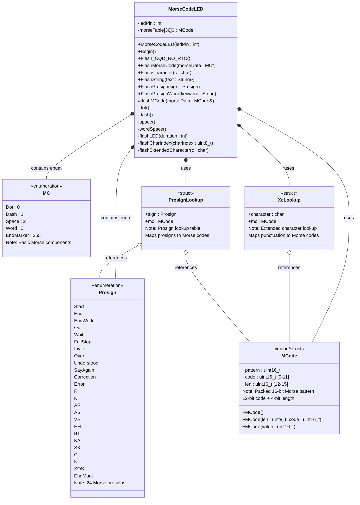

# MorseCodeLED Library - Class Diagram

This library provides Morse code LED flashing functionality for the Binary Clock, primarily used for error signaling when the RTC is unavailable.

## Additional Documents
- [**`README.md`**][README] (GitHub: [`README.md`][README_Git]) - Overview and documentation for the **MorseCodeLED library**.
- [**`InstallUsage.md`**][INSTALL] (GitHub: [`InstallUsage.md`][INSTALL_Git]) - Installation and usage instructions for the **MorseCodeLED library**.
---



## Library Overview

### Purpose
The **MorseCodeLED** library provides Morse code signaling capabilities using an LED. Its primary purpose is to flash error messages when the RTC (Real-Time Clock) is unavailable, but it can also flash arbitrary text and Morse prosigns.

### Key Features
- **Basic Morse Code**: Flash dots, dashes, character spaces, and word spaces
- **Predefined Messages**: Flash "CQD NO RTC" emergency message
- **Text Support**: Flash arbitrary strings (boards with sufficient resources)
- **Prosign Support**: Flash Morse prosigns like SOS, AR, SK, etc.
- **Resource Adaptive**: Truncated functionality on resource-constrained boards (UNO R3)

### Implementation Details

#### Morse Code Timing
- **Dot duration**: 200ms (base unit)
- **Dash duration**: 3× dot duration (600ms)
- **Intra-character space**: 1× dot duration (200ms)
- **Inter-character space**: 3× dot duration (600ms)
- **Inter-word space**: 7× dot duration (1400ms)

#### Data Encoding
The `MCode` union efficiently packs Morse patterns into 16 bits:
- **Bits 0-11**: Pattern: 0 - dot; 1 - dash (max 12 elements)
- **Bits 12-15**: Length (0-12)
- **Example**: Letter 'A' (·−) = `{len=2, code=0b01}` = `0x2001`

#### Lookup Tables
1. **morseTable[36]**: Static lookup for A-Z (0-25) and 0-9 (26-35)
2. **XcLookup**: Extended characters (punctuation, symbols)
3. **ProsignLookup**: Prosigns mapped to their Morse patterns

### Feature Variants

#### Full Feature Set (ESP32/R4 boards)
- `FlashCharacter(char)` - Flash single character
- `FlashString(String)` - Flash text string
- `FlashProsign(Prosign)` - Flash prosign by enum
- `FlashProsignWord(String)` - Flash prosign by keyword

#### Limited Feature Set (UNO R3)
Only the essential emergency signaling:
- `Flash_CQD_NO_RTC()` - Flash "CQD NO RTC" message
- `FlashMorseCode(MC*)` - Flash raw Morse component array

### Supported Prosigns
| Prosign | Morse Code | Meaning |
|---------|------------|---------|
| SOS | `···−−−···` | Life Emergency distress signal |
| CQD | `−·−· −−·− −··` | Come Quick - Distress (old/non-life-emergency) |
| AR | `·−·−·` | End of message |
| SK | `···−·−` | End of contact |
| KA | `−·−·−` | Start of transmission |
| VE | `···−·` | Understood |
| K | `−·−` | Invitation to transmit |
| R | `·−·` | Received OK |
| HH | `········` | Error/Correction |
| BT | `−···−` | New paragraph/separator |
| *...and 14 more* |  | See Prosign enum |

### Usage Example
```cpp
MorseCodeLED morse(LED_BUILTIN);
morse.Begin();

// Error message (all boards)
morse.Flash_CQD_NO_RTC();

// Full-featured boards only:
#ifndef UNO_R3
    morse.FlashString("HELLO WORLD");
    morse.FlashProsign(Prosign::CQD);
    morse.FlashProsignWord("START");
#endif
```

### Design Notes
- **Singleton Pattern**: Typically used with a single LED instance
- **Non-blocking Option**: Could be extended with async/task-based flashing
- **Resource Conscious**: Patterns stored in PROGMEM on resource-limited boards
- **Board Adaptive**: Automatically disables advanced features on UNO R3

### Author's Notes
From the header documentation:
> *"This was my first attempt at using CoPilot to generate code, and the results were mixed. Some code was good, for example packing each Morse code 'character' into a 16-bit value with the length in the upper 4 bits and the pattern in the lower 12 bits. However, when I asked it to generate the lookup table for the characters, it made several mistakes over and over again. None of the code was robust, and there was no error checking. I had to rewrite most of the code to make it work properly. Overall, it was a good learning experience, but I would not rely on CoPilot to generate production code."*

### Dependencies
- **Arduino Core**: `Arduino.h` for hardware abstraction
- **Board Configuration**: Conditional compilation based on `UNO_R3` define

### Historical Context
**CQD** was the original international distress signal before **SOS**. The library uses CQD instead of SOS for non-life-threatening equipment failures (`CQD NO RTC`), reserving SOS for actual emergencies per international convention.

## Repository
[MorseCodeLED on GitHub](https://github.com/Chris-70/WiFiBinaryClock/tree/main/lib/MorseCodeLED)

<!-- Reference Links -->
[INSTALL]: InstallUsage.md
[INSTALL_Git]: https://github.com/Chris-70/WiFiBinaryClock/blob/main/lib/MorseCodeLED/InstallUsage.md
[README]: README.md
[README_Git]: https://github.com/Chris-70/WiFiBinaryClock/blob/main/lib/MorseCodeLED/README.md
